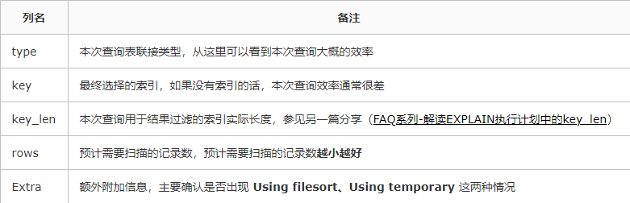
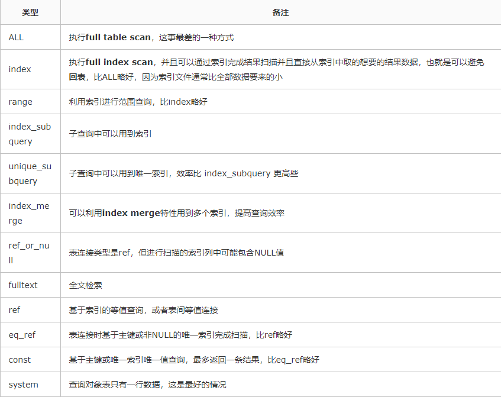
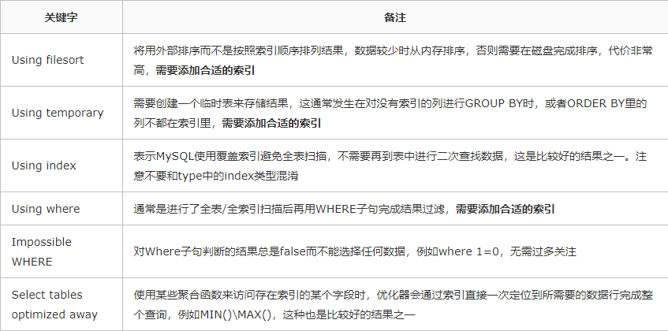

# MySQL知识整理

## MyISAM和InnoDB区别
- 是否支持行级锁 : `MyISAM`只有表级锁(table-level locking)，而`InnoDB`支持行级锁(row-level locking)和表级锁,默认为行级锁。
- 是否支持事务和崩溃后的安全恢复： `MyISAM`强调的是性能，每次查询具有原子性,其执行速度比`InnoDB`类型更快，但是不提供事务支持。但是`InnoDB`提供事务支持事务，外部键等高级数据库功能。 具有事务(commit)、回滚(rollback)和崩溃修复能力(crash recovery capabilities)的事务安全(transaction-safe (ACID compliant))型表。
- 是否支持MVCC(Multiversion Concurrency Control)： 仅`InnoDB`支持。应对高并发事务，MVCC比单纯的加锁更高效；MVCC只在`READ COMMITED`和`REPEATABLE READ`两个隔离级别下工作；MVCC可以使用乐观锁和悲观锁来实现；各种数据库中MVCC实现并不统一。

## 索引

## 介绍
索引是一种用于快速查询和检索数据的数据结构。常见的索引结构有: B树， B+树和Hash。
MySQL索引使用的数据结构主要有BTree索引 和 哈希索引 。对于哈希索引来说，底层的数据结构就是哈希表，因此在绝大多数需求为单条记录查询的时候，可以选择哈希索引，查询性能最快；其余大部分场景，建议选择`BTree`索引。MySQL的`BTree`索引使用的是`B+`树，但是对于主要的两种存储引擎的实现方式是不同的。
- MyISAM：`B+Tree`叶节点的data域存放的数据记录的地址。在索引检索的时候，首先按照`B+Tree`搜索算法搜索索引，如果指定的Key存在，则取出其data域的值，然后以data域的值为地址读取相应的数据记录。这被称为“非聚簇索引”。
- InnoDB：其数据文件本身就是索引文件。相比MyISAM，索引文件和数据文件是分离的，其表数据文件本身就是按照`B+Tree`组织的一个索引结构，树的叶节点data域保存了完整的数据记录。这个索引的key是数据表的主键，因此InnoDB表数据文件本身就是主索引。这被称为“聚簇索引(或聚集索引)”。而其余的索引都做诶辅助索引，副主索引的data域存储相应记录主键的值而不是地址，这也是和MyISAM不同的地方、**在根据主索引搜索时，直接找到key所在的节点即可取出数据；在根据副主索引查找时，则需要先取出主键的值，再走一遍主索引。因此，在设计表的时候，不建议使用过长的字段作为主键，也不建议使用非单调的字段作为主键，这样会造成主索引频繁分裂**。

### 优缺点
- 优点：在读请求大于写请求的场景下可以大大加快数据的检索速度（大大减少的检索的数据量）。另外，通过创建唯一性索引，可以保证数据库表中每一行数据的唯一性。
- 缺点：
    - 创建索引和维护索引需要耗费许多时间：当对表中的数据进行增删改的时候，如果数据有索引，那么索引也需要动态的修改，会降低SQL执行效率。
    - 占用物理存储空间 ：索引需要使用物理文件存储，也会耗费一定空间。

### 索引类型
- 主键索引：数据表的主键列使用的就是主键索引。在mysql的InnoDB的表中，当没有显示的指定表的主键时，InnoDB会自动先检查表中是否有唯一索引的字段，如果有，则选择该字段为默认的主键，否则InnoDB将会自动创建一个6Byte的自增主键。
- 二级索引(辅助索引)：二级索引又称为辅助索引，是因为二级索引的叶子节点存储的数据是主键。也就是说，通过二级索引，可以定位主键的位置。
    - 唯一索引(Unique Key) ：唯一索引也是一种约束。唯一索引的属性列不能出现重复的数据，但是允许数据为NULL，一张表允许创建多个唯一索引。
    - 普通索引(Index) ：普通索引的唯一作用就是为了快速查询数据，一张表允许创建多个普通索引，并允许数据重复和NULL。
    - 前缀索引(Prefix) ：前缀索引只适用于字符串类型的数据。前缀索引是对文本的前几个字符创建索引，相比普通索引建立的数据更小， 因为只取前几个字符。
    - 全文索引(Full Text) ：全文索引主要是为了检索大文本数据中的关键字的信息，是目前搜索引擎数据库使用的一种技术。

###  索引失效的几种情况
- 复合索引未用左列字段。
- like以%开头。
- 需要类型转换。
- where中索引列有运算。
- where中索引列使用了函数。
- 如果mysql觉得全表扫描更快时（数据少）。

## 一条SQL语句在MySQL中如何执行的
- 查询语句
```SQL
update tb_student A set A.age='19' where A.name=' 张三 ';
```
    - 先检查该语句是否有权限，如果没有权限，直接返回错误信息，如果有权限，在 MySQL8.0 版本以前，会先查询缓存，以这条 sql 语句为 key 在内存中查询是否有结果，如果有直接缓存，如果没有，执行下一步。
    - 通过分析器进行词法分析，提取 sql 语句的关键元素，比如提取上面这个语句是查询 select，提取需要查询的表名为 tb_student,需要查询所有的列，查询条件是这个表的 id='1'。然后判断这个 sql 语句是否有语法错误，比如关键词是否正确等等，如果检查没问题就执行下一步。
    - 那么优化器根据自己的优化算法进行选择执行效率最好的一个执行方案（优化器认为，有时候不一定最好）。那么确认了执行计划后就准备开始执行了。
    - 进行权限校验，如果没有权限就会返回错误信息，如果有权限就会调用数据库引擎接口，返回引擎的执行结果。
- 更新语句
```SQL
update tb_student A set A.age='19' where A.name=' 张三 ';
```
    - 先查询到张三这一条数据，如果有缓存，也是会用到缓存。
    - 然后拿到查询的语句，把 age 改为 19，然后调用引擎 API 接口，写入这一行数据，InnoDB 引擎把数据保存在内存中，同时记录 redo log，此时 redo log 进入 prepare 状态，然后告诉执行器，执行完成了，随时可以提交。
    - 执行器收到通知后记录 binlog，然后调用引擎接口，提交 redo log 为提交状态。
    - 更新完成。

## explain执行计划中要重点关注哪些要素


`type`的几种结果：


Extra列中需要注意出现的几种情况：


## 事务

### 事务的特性（ACID）

- **原子性**：事务最是小的执行单位，不允许分割，事务的原子性确保动作要么全部完成，要么完全不起作用；
- **一致性**：执行事务前后，数据保持一致，例如转账业务中，无论食物是否成功，转账者和收款人的总额应该是不变的；
- **隔离性**：并发访问数据库时，一个用户的事务不被其他事务所干扰，各并发事务之间数据库是独立的；
- **持久性**：一个事务被提交之后，他对数据库中数据的改变是持久的，即使数据库发生故障也不应该对其有任何影响。

### 并发事务带来的问题

- **脏读**：当一个事务正在访问数据并且对数据进行了修改，而这种修改还没有提交到数据库中，这时另外一个事务也访问了这个数据，然后使用了这个数据。因为这个数据是还没有提交的数据，那么另外一个事务读到的这个数据是“脏数据”，依据“脏数据”所做的操作可能是不正确的。
- **丢失修改**：指在一个事务读取一个数据时，另外一个事务也访问了该数据，那么在第一个事务中修改了这个数据后，第二个事务也修改了这个数据。这样第一个事务内的修改结果就被丢失，因此成为丢失修改。例如事务1读取某表中的数据A=20，事务2也读取A=20，事务1修改A=A-1，事务2也修改A=A-1，最终结果A=19，事务1的修改被丢失。
- **不可重复读**：指在一个事务内多次读统一数据。在这个事务还没有结束时，另一个事务也访问该数据。那么，在第一个事务中的两次读数据之间，由于第二个事务的修改导致第一个事务两次读取的数据可能不太一样。这就发生了在一个事务内两次读到的数据是不一样的情况，因此称为不可重复读。
- **幻读**：幻读与不可重复读类似。它发生在一个事务（T1）读取了几行数据，接着另一个并发事务（T2）插入了一些数据时。在随后的查询中，第一个事务（T1）就会发现多了一些原本不存在的记录，就好像发生了幻觉一样，所以称为幻读。

#### 不可重复读和幻读区别
不可重复读的重点是**修改**，幻读的重点在于**新增或者删除**。

### 事务隔离级别

- READ-UNCOMMITTED（读取未提交）：最低的隔离级别，**允许读取尚未提交的数据变更**，可能会导致**脏读、幻读或不可重复读**。
- READ-COMMITTED（读取已提交）：**允许读取并发事务已经提交的数据**，可以**阻止脏读**，但是**幻读或不可重复读**仍有可能发生。
- REPEATABLE-READ（可重复读）：**对同一字段的多次读取结果都是一致的，除非数据是被本身事务自己所修改**，可以**阻止脏读**，但**幻读**仍有可能发生。
- SERALIZABLE（可串行化）：最高的隔离级别，完全服从ACID的隔离级别。**所有的事务依次逐个执行**，这样事务之间就完全不可能产生干扰，也就是说，该级别可以防止**脏读、不可重复读以及幻读**。

|     隔离级别      | 脏读 | 不可重复读 | 幻读 |
| ---------------- | --- | --------- | --- |
| READ-UNCOMMITTED | ✔   | ✔        | ✔   |
| READ-COMMITTED   | ✘   | ✔        | ✔   |
| REPEATABLE-READ  | ✘   | ✘        | ✔   |
| SERIALIZABLE     | ✘   | ✘        | ✘   |

因为隔离级别越低，事务请求的锁越少，所以大部分数据库系统的隔离级别都是**READ-COMMITTED**，但是**InnoDB存储引擎**默认使用**REPEATABLE-READ**并不会有任何性能损失。
InnoDB存储引擎在**分布式事务**的情况下一般会用到**SERIALIZABLE**隔离级别。
