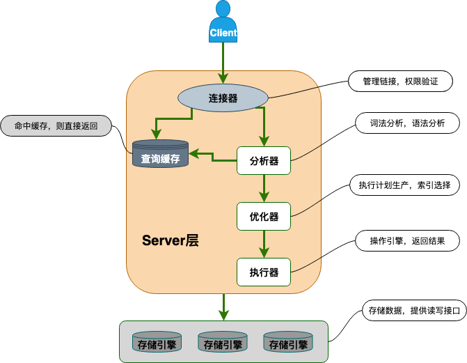

# MySQL知识整理

## 基础

### VARCHAR(100)和 VARCHAR(10)的区别
虽说 VARCHAR(100)和 VARCHAR(10)能存储的字符范围不同，但二者存储相同的字符串，所占用磁盘的存储空间其实是一样的。
不过，VARCHAR(100) 会消耗更多的内存。这是因为 VARCHAR 类型在内存中操作时，通常会分配固定大小的内存块来保存值，即使用字符类型中定义的长度。例如在进行排序的时候，VARCHAR(100)是按照 100 这个长度来进行的，也就会消耗更多内存。

### DATETIME 和 TIMESTAMP 的区别
- DATETIME 类型没有时区信息，TIMESTAMP 和时区有关。
- TIMESTAMP 只需要使用 4 个字节的存储空间，但是 DATETIME 需要耗费 8 个字节的存储空间。但是，这样同样造成了一个问题，Timestamp 表示的时间范围更小。
    - DATETIME：1000-01-01 00:00:00 ~ 9999-12-31 23:59:59
    - Timestamp：1970-01-01 00:00:01 ~ 2037-12-31 23:59:59

### NULL 和 '' 的区别
- `NULL` 代表一个不确定的值,就算是两个 `NULL`,它俩也不一定相等。
- `''`的长度是 0，是不占用空间的，而`NULL` 是需要占用空间的。
- `NULL` 会影响聚合函数的结果。
- 查询 `NULL` 值时，必须使用 `IS NULL` 或 `IS NOT NULLl` 来判断，而不能使用 =、!=、 <、> 之类的比较运算符。而`''`是可以使用这些比较运算符的。

## 基础架构

- `连接器`：身份认证和权限相关(登录 MySQL 的时候)。
- `查询缓存`：执行查询语句的时候，会先查询缓存（MySQL 8.0 版本后移除，因为这个功能不太实用）。
- `分析器`： 分析SQL 语句要干嘛，再检查SQL 语句语法是否正确。
- `优化器`： 按照 MySQL 认为最优的方案去执行。
- `执行器`： 执行语句，然后从存储引擎返回数据。 执行语句之前会先判断是否有权限，如果没有权限的话，就会报错。
- `插件式存储引擎`：主要负责数据的存储和读取，采用的是插件式架构，支持 InnoDB、MyISAM、Memory 等多种存储引擎。

## 存储引擎

### InnoDB存储引擎的特点
- 支持行级锁(row-level locking)和表级锁,默认为行级锁。
- 支持事务，实现了 SQL 标准定义了四个隔离级别，具有提交(commit)和回滚(rollback)事务的能力。
- 支持外键。
- 支持数据库异常崩溃后的安全恢复，依赖于`redo log`。
- 支持MVCC(Multiversion Concurrency Control)。应对高并发事务，MVCC比单纯的加锁更高效；MVCC 通过创建数据的多个版本和使用快照读取来实现并发控制。读操作使用旧版本数据的快照，写操作创建新版本，并确保原始版本仍然可用。这样，不同的事务可以在一定程度上并发执行，而不会相互干扰，从而提高了数据库的并发性能和数据一致性。MVCC只在`READ COMMITED`和`REPEATABLE READ`两个隔离级别下工作。

## 索引
索引是一种用于快速查询和检索数据的数据结构。在 MySQL 中，无论是 Innodb 还是 MyIsam，都使用了 B+树作为索引结构。

### 优缺点

#### 优点
- 使用索引可以大大加快数据的检索速度（大大减少检索的数据量）, 减少 IO 次数，这也是创建索引的最主要的原因。
- 通过创建唯一性索引，可以保证数据库表中每一行数据的唯一性。

#### 缺点
- **创建索引和维护索引需要耗费许多时间**：当对表中的数据进行增删改的时候，如果数据有索引，那么索引也需要动态的修改，会降低SQL执行效率。
- **占用物理存储空间**：索引需要使用物理文件存储，也会耗费一定空间。

### 索引类型

#### 按照底层存储方式角度划分
- **聚簇索引（聚集索引）**：索引结构和数据一起存放的索引，InnoDB 中的主键索引就属于聚簇索引。
- **非聚簇索引（非聚集索引）**：索引结构和数据分开存放的索引，二级索引(辅助索引)就属于非聚簇索引。

#### 按照应用维度划分
- **主键索引**：加速查询 + 列值唯一（不可以有 NULL）+ 表中只有一个。
- **普通索引**：仅加速查询。
- **唯一索引**：加速查询 + 列值唯一（可以有 NULL）。
- **覆盖索引**：一个索引包含（或者说覆盖）所有需要查询的字段的值。
- **联合索引**：多列值组成一个索引，专门用于组合搜索，其效率大于索引合并。(满足最左前缀匹配原则)
    - 最左前缀匹配原则：指的是在使用联合索引时，MySQL 会根据索引中的字段顺序，从左到右依次匹配查询条件中的字段。如果查询条件与索引中的最左侧字段相匹配，那么 MySQL 就会使用索引来过滤数据，这样可以提高查询效率。最左匹配原则会一直向右匹配，直到遇到范围查询（如 >、<）为止。对于 >=、<=、BETWEEN 以及前缀匹配 LIKE 的范围查询，不会停止匹配。
- **全文索引**：对文本的内容进行分词，进行搜索。目前只有 CHAR、VARCHAR ，TEXT 列上可以创建全文索引。一般不会使用，效率较低，通常使用搜索引擎如 ElasticSearch 代替。

### 索引下推
索引下推（Index Condition Pushdown，简称 ICP） 是 一项索引优化功能，它允许存储引擎在索引遍历过程中，执行部分 WHERE字句的判断条件，直接过滤掉不满足条件的记录，从而减少回表次数，提高查询效率。

#### 应用范围
- 适用于 InnoDB 引擎和 MyISAM 引擎的查询。适用于执行计划是 range, ref, eq_ref, ref_or_null 的范围查询。
- 对于 InnoDB 表，仅用于非聚簇索引。索引下推的目标是减少全行读取次数，从而减少 I/O 操作。对于 InnoDB 聚集索引，完整的记录已经读入 InnoDB 缓冲区。在这种情况下使用索引下推 不会减少 I/O。
- 子查询不能使用索引下推，因为子查询通常会创建临时表来处理结果，而这些临时表是没有索引的。
- 存储过程不能使用索引下推，因为存储引擎无法调用存储函数。

###  索引失效的几种情况
- 创建了复合索引但查询条件未遵守最左前缀匹配原则。
- like以%开头。
-发生隐式转换。
- 在索引列上进行计算、函数、类型转换等操作。
- 查询条件中使用 OR，且 OR 的前后条件中有一个列没有索引，涉及的索引都不会被使用到。
- IN 的取值范围较大时会导致索引失效。

### 正确使用索引的一些建议
- 选择合适的字段创建索引：
    - 不为 NULL 的字段。
    - 被频繁查询的字段。
    - 被作为条件查询的字段。
    - 频繁需要排序的字段。
    - 被经常频繁用于连接的字段。
- 被频繁更新的字段应该慎重建立索引。
- 限制每张表上的索引数量，建议单张表索引不超过 5 个。
- 尽可能的考虑建立联合索引而不是单列索引。
- 字符串类型的字段使用前缀索引代替普通索引，前缀索引仅限于字符串类型，较普通索引会占用更小的空间。

## 一条SQL语句在MySQL中如何执行的
- 查询语句
```SQL
update tb_student A set A.age='19' where A.name=' 张三 ';
```
    - 先检查该语句是否有权限，如果没有权限，直接返回错误信息，如果有权限，在 MySQL8.0 版本以前，会先查询缓存，以这条 sql 语句为 key 在内存中查询是否有结果，如果有直接缓存，如果没有，执行下一步。
    - 通过分析器进行词法分析，提取 sql 语句的关键元素，比如提取上面这个语句是查询 select，提取需要查询的表名为 tb_student,需要查询所有的列，查询条件是这个表的 id='1'。然后判断这个 sql 语句是否有语法错误，比如关键词是否正确等等，如果检查没问题就执行下一步。
    - 那么优化器根据自己的优化算法进行选择执行效率最好的一个执行方案（优化器认为，有时候不一定最好）。那么确认了执行计划后就准备开始执行了。
    - 进行权限校验，如果没有权限就会返回错误信息，如果有权限就会调用数据库引擎接口，返回引擎的执行结果。
- 更新语句
```SQL
update tb_student A set A.age='19' where A.name=' 张三 ';
```
    - 先查询到张三这一条数据，如果有缓存，也是会用到缓存。
    - 然后拿到查询的语句，把 age 改为 19，然后调用引擎 API 接口，写入这一行数据，InnoDB 引擎把数据保存在内存中，同时记录 redo log，此时 redo log 进入 prepare 状态，然后告诉执行器，执行完成了，随时可以提交。
    - 执行器收到通知后记录 binlog，然后调用引擎接口，提交 redo log 为提交状态。
    - 更新完成。

## explain执行计划中要重点关注哪些要素


`type`的几种结果：


Extra列中需要注意出现的几种情况：


## 事务

### 事务的特性（ACID）

- **原子性**：事务最是小的执行单位，不允许分割，事务的原子性确保动作要么全部完成，要么完全不起作用；
- **一致性**：执行事务前后，数据保持一致，例如转账业务中，无论食物是否成功，转账者和收款人的总额应该是不变的；
- **隔离性**：并发访问数据库时，一个用户的事务不被其他事务所干扰，各并发事务之间数据库是独立的；
- **持久性**：一个事务被提交之后，他对数据库中数据的改变是持久的，即使数据库发生故障也不应该对其有任何影响。

### 并发事务带来的问题

- **脏读**：当一个事务正在访问数据并且对数据进行了修改，而这种修改还没有提交到数据库中，这时另外一个事务也访问了这个数据，然后使用了这个数据。因为这个数据是还没有提交的数据，那么另外一个事务读到的这个数据是“脏数据”，依据“脏数据”所做的操作可能是不正确的。
- **丢失修改**：指在一个事务读取一个数据时，另外一个事务也访问了该数据，那么在第一个事务中修改了这个数据后，第二个事务也修改了这个数据。这样第一个事务内的修改结果就被丢失，因此成为丢失修改。例如事务1读取某表中的数据A=20，事务2也读取A=20，事务1修改A=A-1，事务2也修改A=A-1，最终结果A=19，事务1的修改被丢失。
- **不可重复读**：指在一个事务内多次读统一数据。在这个事务还没有结束时，另一个事务也访问该数据。那么，在第一个事务中的两次读数据之间，由于第二个事务的修改导致第一个事务两次读取的数据可能不太一样。这就发生了在一个事务内两次读到的数据是不一样的情况，因此称为不可重复读。
- **幻读**：幻读与不可重复读类似。它发生在一个事务（T1）读取了几行数据，接着另一个并发事务（T2）插入了一些数据时。在随后的查询中，第一个事务（T1）就会发现多了一些原本不存在的记录，就好像发生了幻觉一样，所以称为幻读。

#### 不可重复读和幻读区别
不可重复读的重点是**修改**，幻读的重点在于**新增或者删除**。

### 事务隔离级别

- READ-UNCOMMITTED（读取未提交）：最低的隔离级别，**允许读取尚未提交的数据变更**，可能会导致**脏读、幻读或不可重复读**。
- READ-COMMITTED（读取已提交）：**允许读取并发事务已经提交的数据**，可以**阻止脏读**，但是**幻读或不可重复读**仍有可能发生。
- REPEATABLE-READ（可重复读）：**对同一字段的多次读取结果都是一致的，除非数据是被本身事务自己所修改**，可以**阻止脏读**，但**幻读**仍有可能发生。
- SERALIZABLE（可串行化）：最高的隔离级别，完全服从ACID的隔离级别。**所有的事务依次逐个执行**，这样事务之间就完全不可能产生干扰，也就是说，该级别可以防止**脏读、不可重复读以及幻读**。

|     隔离级别      | 脏读 | 不可重复读 | 幻读 |
| ---------------- | --- | --------- | --- |
| READ-UNCOMMITTED | ✔   | ✔        | ✔   |
| READ-COMMITTED   | ✘   | ✔        | ✔   |
| REPEATABLE-READ  | ✘   | ✘        | ✔   |
| SERIALIZABLE     | ✘   | ✘        | ✘   |

因为隔离级别越低，事务请求的锁越少，所以大部分数据库系统的隔离级别都是**READ-COMMITTED**，但是**InnoDB存储引擎**默认使用**REPEATABLE-READ**并不会有任何性能损失。
InnoDB存储引擎在**分布式事务**的情况下一般会用到**SERIALIZABLE**隔离级别。

## MySQL三大日志

### binlog（归档日志）
binlog 是逻辑日志，会记录所有涉及更新数据的逻辑操作，并且是顺序写。

### redo log（重做日志）
redo log（重做日志）是 InnoDB 存储引擎独有的，它让 MySQL 拥有了崩溃恢复能力。
MySQL 中数据是以页为单位，你查询一条记录，会从硬盘把一页的数据加载出来，加载出来的数据叫数据页，会放入到 `Buffer Pool` 中。后续的查询都是先从 `Buffer Pool` 中找，没有命中再去硬盘加载，减少硬盘 IO 开销，提升性能。更新表数据的时候，也是如此，发现 `Buffer Pool` 里存在要更新的数据，就直接在 `Buffer Pool` 里更新。然后会把“在某个数据页上做了什么修改”记录到重做日志缓存（`redo log buffer`）里，接着刷盘到 redo log 文件里。

#### 刷盘时机
- 事务提交。
- log buffer 空间不足时。
- 事务日志缓冲区（transaction log buffer）满时。
-  定期会执行Checkpoint（检查点）操作时。
- 后台刷新线程周期性刷盘数据时。
- 正常关闭服务器。

#### 刷盘策略
- **0**（默认）：设置为 0 的时候，表示每次事务提交时不进行刷盘操作。这种方式性能最高，但是也最不安全，因为如果 MySQL 挂了或宕机了，可能会丢失最近 1 秒内的事务。
- **1**：设置为 1 的时候，表示每次事务提交时都将进行刷盘操作。这种方式性能最低，但是也最安全，因为只要事务提交成功，redo log 记录就一定在磁盘里，不会有任何数据丢失。
- **2**：设置为 2 的时候，表示每次事务提交时都只把 log buffer 里的 redo log 内容写入 page cache（文件系统缓存）。page cache 是专门用来缓存文件的，这里被缓存的文件就是 redo log 文件。这种方式的性能和安全性都介于前两者中间。

### 两阶段提交
redo log（重做日志）让 InnoDB 存储引擎拥有了崩溃恢复能力。
binlog（归档日志）保证了 MySQL 集群架构的数据一致性。
虽然它们都属于持久化的保证，但是侧重点不同。
在执行更新语句过程，会记录 redo log 与 binlog 两块日志，以基本的事务为单位，redo log 在事务执行过程中可以不断写入，而 binlog 只有在提交事务时才写入，所以 redo log 与 binlog 的写入时机不一样。
将 redo log 的写入拆成了两个步骤`prepare`和`commit`，这就是**两阶段提交**。
提交顺序：redo log prepare -> binlog write -> redo log commit

### undo log（回滚日志）
每一个事务对数据的修改都会被记录到 undo log ，当执行事务过程中出现错误或者需要执行回滚操作的话，MySQL 可以利用 undo log 将数据恢复到事务开始之前的状态。
undo log 属于逻辑日志，记录的是 SQL 语句，比如说事务执行一条 DELETE 语句，那 undo log 就会记录一条相对应的 INSERT 语句。同时，undo log 的信息也会被记录到 redo log 中，因为 undo log 也要实现持久性保护。并且，undo-log 本身是会被删除清理的，例如 INSERT 操作，在事务提交之后就可以清除掉了；UPDATE/DELETE 操作在事务提交不会立即删除，会加入 history list，由后台线程 purge 进行清理。