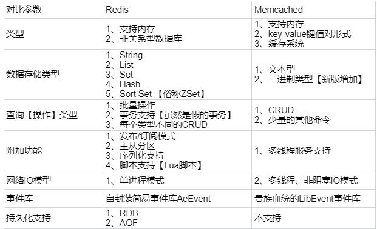
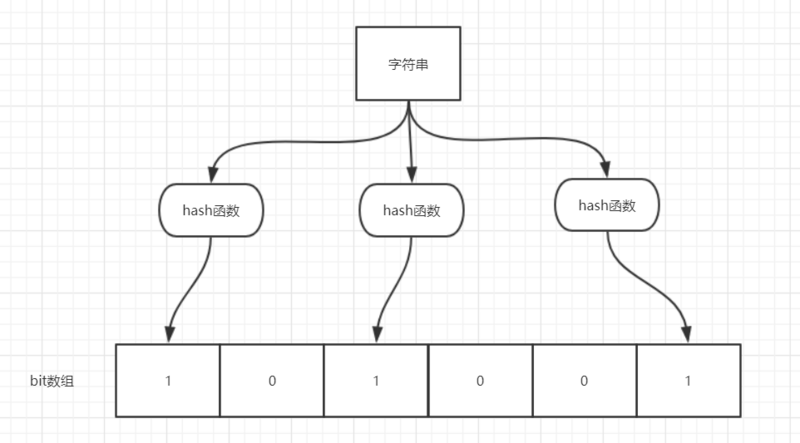

# Redis

## 介绍
redis 就是一个数据库，不过与传统数据库不同的是 redis 的数据是存在内存中的，所以读写速度非常快，因此 redis 被广泛应用于缓存方向。

## 为什么要用 redis
- 高性能：Redis作为缓存数据库是将数据存在内存中的，操作内存要比操作数据库的本地持久化数据要快。
- 高并发：直接操作缓存能够承受的请求是远远大于直接访问数据库的，尤其是热门的待读数据，所以通常将这些数据存入缓存。

## redis 的线程模型
redis 内部使用文件事件处理器 file event handler，这个文件事件处理器是单线程的，所以 redis 才叫做单线程的模型。它采用 IO 多路复用机制（事件驱动，来哪个消息处理哪个）同时监听多个 socket，会将 socket 产生的事件放入队列中排队，事件分派器每次从队列中取出一个事件，把该事件交给对应的事件处理器进行处理。

## redis 和 memcached 的区别
- redis支持更丰富的数据类型（支持更复杂的应用场景）：Redis不仅仅支持简单的k/v类型的数据，同时还提供list，set，zset，hash等数据结构的存储。memcached支持简单的数据类型，String。
- Redis支持数据的持久化，可以将内存中的数据保持在磁盘中，重启的时候可以再次加载进行使用,而Memecache把数据全部存在内存之中。
- 集群模式：memcached没有原生的集群模式，需要依靠客户端来实现往集群中分片写入数据；但是 redis 目前是原生支持 cluster 模式的。
- Memcached是多线程，非阻塞IO复用的网络模型；Redis使用单线程的多路 IO 复用模型。


## redis 常见数据结构以及使用场景分析
- String数据结构是简单的key-value类型，value其实不仅可以是String，也可以是数字。
    - 应用场景：常规计数：微博数，粉丝数等。
- Hash：hash 是一个 string 类型的 field 和 value 的映射表，hash 特别适合用于存储对象，后续操作的时候，你可以直接仅仅修改这个对象中的某个字段的值。
    - 应用场景：存储用户信息，商品信息等等。
- List： Redis list 的实现为一个双向链表，即可以支持反向查找和遍历，更方便操作，不过带来了部分额外的内存开销。
    - 应用场景：比如微博的关注列表，粉丝列表，消息列表等功能。
- Set： 不重复list。
    - 应用场景：同关注、共同粉丝、共同喜好等功能。
- Sorted Set：和set相比，sorted set增加了一个权重参数score，使得集合中的元素能够按score进行有序排列。
    - 应用场景：在直播系统中，实时排行信息包含直播间在线用户列表，各种礼物排行榜，弹幕消息（可以理解为按消息维度的消息排行榜）等信息。

## redis过期键的删除策略
- 定期删除：redis默认是每隔 100ms 就随机抽取一些设置了过期时间的key，检查其是否过期，如果过期就删除。
- 懒惰删除：放任键过期不管，但是每次从键空间中获取键时，都检查取得的键是否过期，如果过期的话，就删除该键;如果没有过期，就返回该键。

## redis 6种内存淘汰机制
- volatile-lru：从已设置过期时间的数据集（server.db[i].expires）中挑选最近最少使用的数据淘汰
- volatile-ttl：从已设置过期时间的数据集（server.db[i].expires）中挑选将要过期的数据淘汰
- volatile-random：从已设置过期时间的数据集（server.db[i].expires）中任意选择数据淘汰
- allkeys-lru：当内存不足以容纳新写入数据时，在键空间中，移除最近最少使用的key（这个是最常用的）
- allkeys-random：从数据集（server.db[i].dict）中任意选择数据淘汰
- no-eviction：禁止驱逐数据，也就是说当内存不足以容纳新写入数据时，新写入操作会报错。

## redis 持久化机制
- 快照（snapshotting）持久化（RDB）：Redis可以通过创建快照来获得存储在内存里面的数据在某个时间点上的副本。Redis创建快照之后，可以对快照进行备份，可以将快照复制到其他服务器从而创建具有相同数据的服务器副本（Redis主从结构，主要用来提高Redis性能），还可以将快照留在原地以便重启服务器的时候使用。
- AOF（append-only file）持久化：与快照持久化相比，AOF持久化 的实时性更好，因此已成为主流的持久化方案。默认情况下Redis没有开启AOF（append only file）方式的持久化，可以通过appendonly参数开启：`appendonly yes`，开启AOF持久化后每执行一条会更改Redis中的数据的命令，Redis就会将该命令写入硬盘中的AOF文件。

## redis 事务
Redis 通过 MULTI、EXEC、WATCH 等命令来实现事务(transaction)功能。事务提供了一种将多个命令请求打包，然后一次性、按顺序地执行多个命令的机制，并且在事务执行期间，服务器不会中断事务而改去执行其他客户端的命令请求，它会将事务中的所有命令都执行完毕，然后才去处理其他客户端的命令请求。

## 缓存雪崩
- 描述：缓存同一时间大面积的失效，所以，后面的请求都会落到数据库上，造成数据库短时间内承受大量请求而崩掉。
- 解决方案：
    - 事前：尽量保证整个 redis 集群的高可用性，发现机器宕机尽快补上。选择合适的内存淘汰策略。
    - 事中：本地ehcache缓存 + 限流+降级(返回一些设定好的友情提示或默认值)组件，避免MySQL崩掉。
    - 事后：利用 redis 持久化机制保存的数据尽快恢复缓存。

## 缓存穿透
- 描述：就是大量请求的 key 根本不存在于缓存中，导致请求直接到了数据库上，根本没有经过缓存这一层。
- 解决方案：把所有可能存在的请求的值都存放在布隆过滤器中，当用户请求过来时，用布隆过滤器过滤无效key，有效key则按正常流程操作。

### 布隆过滤器

#### 原理介绍
当一个元素加入布隆过滤器中的时候，会进行如下操作：

- 使用布隆过滤器中的哈希函数对元素值进行计算，得到哈希值（有几个哈希函数得到几个哈希值）。
- 根据得到的哈希值，在位数组中把对应下标的值置为 1。

当我们需要判断一个元素是否存在于布隆过滤器的时候，会进行如下操作：

- 对给定元素再次进行相同的哈希计算；
- 得到值之后判断位数组中的每个元素是否都为 1，如果值都为 1，那么说明这个值在布隆过滤器中，如果存在一个值不为 1，说明该元素不在布隆过滤器中。


不同的字符串可能哈希出来的位置相同，这种情况我们可以**适当增加位数组大小或者调整我们的哈希函数**。

综上，我们可以得出：**布隆过滤器说某个元素存在，小概率会误判。布隆过滤器说某个元素不在，那么这个元素一定不在**。

#### 使用场景
- 判断给定数据是否存在：比如判断一个数字是否在于包含大量数字的数字集中（数字集很大，5亿以上！）、 防止缓存穿透（判断请求的数据是否有效避免直接绕过缓存请求数据库）等等、邮箱的垃圾邮件过滤、黑名单功能等等。
- 去重：比如爬给定网址的时候对已经爬取过的 URL 去重。

java实现：
```java

import java.util.BitSet;

public class MyBloomFilter {

    /**
     * 位数组的大小
     */
    private static final int DEFAULT_SIZE = 2 << 24;
    /**
     * 通过这个数组可以创建 6 个不同的哈希函数
     */
    private static final int[] SEEDS = new int[]{3, 13, 46, 71, 91, 134};

    /**
     * 位数组。数组中的元素只能是 0 或者 1
     */
    private BitSet bits = new BitSet(DEFAULT_SIZE);

    /**
     * 存放包含 hash 函数的类的数组
     */
    private SimpleHash[] func = new SimpleHash[SEEDS.length];

    /**
     * 初始化多个包含 hash 函数的类的数组，每个类中的 hash 函数都不一样
     */
    public MyBloomFilter() {
        // 初始化多个不同的 Hash 函数
        for (int i = 0; i < SEEDS.length; i++) {
            func[i] = new SimpleHash(DEFAULT_SIZE, SEEDS[i]);
        }
    }

    /**
     * 添加元素到位数组
     */
    public void add(Object value) {
        for (SimpleHash f : func) {
            bits.set(f.hash(value), true);
        }
    }

    /**
     * 判断指定元素是否存在于位数组
     */
    public boolean contains(Object value) {
        boolean ret = true;
        for (SimpleHash f : func) {
            ret = ret && bits.get(f.hash(value));
        }
        return ret;
    }

    /**
     * 静态内部类。用于 hash 操作！
     */
    public static class SimpleHash {

        private int cap;
        private int seed;

        public SimpleHash(int cap, int seed) {
            this.cap = cap;
            this.seed = seed;
        }

        /**
         * 计算 hash 值
         */
        public int hash(Object value) {
            int h;
            return (value == null) ? 0 : Math.abs(seed * (cap - 1) & ((h = value.hashCode()) ^ (h >>> 16)));
        }

    }
}
```

