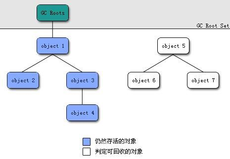

# Java内存知识梳理

## Java运行时内存区域划分

线程私有：

- 程序计数器
- 虚拟机栈
- 本地方法栈

线程共享的：

- 堆
- 方法区
- 直接内存

## 程序计数器
程序计数器用于记录当前线程执行代码的位置。

## 虚拟机栈
Java虚拟机栈服务于Java代码，由一个个栈帧组成，而每个栈帧都拥有：局部变量表、操作数栈、动态链接、方法出口等信息。局部变量表主要存放了**编译器可知的各种数据类型**和**对象引用**。

## 本地方法栈和虚拟机栈的区别
- 虚拟机栈为虚拟机执行Java方法(也就是字节码)服务。
- 本地方法栈则为虚拟机使用到的Native方法服务。
- 在HotSpot虚拟机中和Java虚拟机栈合二为一。

## 堆
Java堆是所有线程共享的一块内存区域，**此区域存在的唯一目的就是存放对象实例**。也被称为**GC堆**，按照分代垃圾回收算法，Java堆可分为：新生代和老年代，再细致点可分为：Eden空间、From Survivor、To Survivor空间等。**进一步划分的目的是更好地回收内存，或者更快地分配内存**。

在JDK1.8中移除了整个永久代，取而代之的是一个叫**元空间(Metaspace)**的区域(永久代使用的是JVM的堆内存空间，而元空间使用的是物理内存，直接受到本机的物理内存限制)。

### JVM垃圾回收的过程
大部分情况，对象都会首先在 Eden 区域分配，在一次新生代垃圾回收后，如果对象还存活，则会进入 s1("To")，并且对象的年龄还会加 1(Eden 区->Survivor 区后对象的初始年龄变为 1)，当它的年龄增加到一定程度（默认为 15 岁，并不一定都是，由垃圾回收器种类决定），就会被晋升到老年代中。对象晋升到老年代的年龄阈值，可以通过参数 -XX:MaxTenuringThreshold 来设置。经过这次GC后，Eden区和"From"区已经被清空。这个时候，"From"和"To"会交换他们的角色，也就是新的"To"就是上次GC前的“From”，新的"From"就是上次GC前的"To"。不管怎样，都会保证名为To的Survivor区域是空的。Minor GC会一直重复这样的过程，直到“To”区被填满，"To"区被填满之后，会将所有对象移动到老年代中。

### Minor GC 和 Major GC 有什么不同呢？
- 新生代 GC（Minor GC）:指发生新生代的的垃圾收集动作，Minor GC 非常频繁，回收速度一般也比较快。
- 老年代 GC（Major GC）:指发生在老年代的 GC，出现了 Major GC 经常会伴随至少一次的 Minor GC（并非绝对），Major GC 的速度一般会比 Minor GC 的慢 10 倍以上。

### 为什么大对象直接进老年代
为了避免因为Minor GC导致频繁复制大对象，这样会降低垃圾回收的效率。

## 如何判断一个对象已经无效
- 引用计数法：给对象中添加一个引用计数器，每当有一个地方引用它，计数器就加 1；当引用失效，计数器就减 1；任何时候计数器为 0 的对象就是不可能再被使用的。
    - 优点：实现简单，效率高
    - 缺点：很难解决对象之间相互循环引用的问题
- 可达性分析算法：这个算法的基本思想就是通过一系列的称为 “GC Roots” 的对象作为起点，从这些节点开始向下搜索，节点所走过的路径称为引用链，当一个对象到 GC Roots 没有任何引用链相连的话，则证明此对象是不可用的。

## 4种引用
- 强引用：普通的对象引用，不会被垃圾回收。
- 软引用：还有用但非必需的对象，用java.lang.ref.SoftReference类表示。
- 弱引用：弱引用是比软引用还弱的引用，在系统进行GC 时，只要发现弱引用，不管系统的堆空间是用了一点还是用了一大半，都会回收弱引用的对象。
- 虚引用：虚引用是所有引用中最弱的一个持有一个虚引用的对象，和没有引用一样，随时都有可能会被垃圾回收器回收，当用虚引用的get方法去尝试获得强引用对象时总是会失败，并且他必须和引用队列一起使用，用于跟踪垃圾回收过程，当垃圾回收器回收一个持有虚引用的对象时，在回收对象后，将这个虚引用对象加入到引用队列中，用来通知应用程序垃圾的回收情况。

## 方法区
方法区用于存储**已被虚拟机加载的类信息、常量、静态变量、即时编译器编译后的代码等数据**。又称**Non-Heap(非堆)**，目的应该是与Java堆区分开来。相对而言，垃圾收集行为在这个区域是比较少出现的，但并非数据进入方法区后就“永久存在”了。

## 运行时常量池
运行时常量池是方法区的一部分。Class文件中除了类的版本、字段、方法、接口等描述信息外，还有常量池信息(用于存放编译器生成的各种**字面量**和**符号引用**)。JDK1.7及之后版本的JVM已经**将运行时常量池从方法区移了出来，在Java堆(Heap)中开辟了一块区域存放运行时常量池**。

## Java创建对象的过程

1. 类加载检查：虚拟机遇到一条new指令时，首先会去检查这个指令的参数是否能在常量池中定位到这个类的符号引用，并且检查这个符号引用代表的类是否被加载、解析和初始化过。如果没有，那必须先执行相应的类加载过程。
2. 分配内存：在类检查通过后，虚拟机将为新生对象分配内存。对象所需的内存大小在类加载完成后便可确定，为对象分配空间的任务等同于把一块确定大小的内存从Java堆中划分出来。分配方式有“指针碰撞”和“空闲列表”两种，选择哪种分配方式由Java堆是否规整决定，而Java堆是否规整又由所采用的垃圾收集器是否带有压缩整理功能决定。

3. 初始化零值：内存分配完成后，虚拟机需要将分配到的内存空间都初始化零值(不包括对象头)。
4. 设置对象头：初始化零值完成后，虚拟机要对对象进行必要的设置，例如对象实例对应的类、类的元数据信息位置、对象的哈希码、对象的GC分代年龄等信息。另外，根据虚拟机当前运行状态的不同，如是否启用偏向锁等，对象头会有不同的设置方式。
5. 执行init方法：执行代码中的`<init>`方法。

## GC收集器的算法
- 标记-清除算法：首先标记出所有需要回收的对象，在标记完成后统一回收所有被标记的对象。
    - 缺点：效率低，标记清除后会产生大量不连续的碎片
- 复制算法：为了解决效率问题，“复制”收集算法出现了。它可以将内存分为大小相同的两块，每次使用其中的一块。当这一块的内存使用完后，就将还存活的对象复制到另一块去，然后再把使用的空间一次清理掉。这样就使每次的内存回收都是对内存区间的一半进行回收。
- 标记-整理算法：根据老年代的特点提出的一种标记算法，标记过程仍然与“标记-清除”算法一样，但后续步骤不是直接对可回收对象回收，而是让所有存活的对象向一端移动，然后直接清理掉端边界以外的内存。
- 分代收集算法

## 垃圾收集器
- Serial收集器
- ParNew收集器
- Parallel Scanvenge收集器
- CMS收集器
- G1收集器

## 常用 GC 调优策略
- 将新对象预留在新生代，由于 Full GC 的成本远高于 Minor GC，因此尽可能将对象分配在新生代是明智的做法，实际项目中根据 GC 日志分析新生代空间大小分配是否合理，适当通过“-Xmn”命令调节新生代大小，最大限度降低新对象直接进入老年代的情况。
- 大对象进入老年代，虽然大部分情况下，将对象分配在新生代是合理的。但是对于大对象这种做法却值得商榷，大对象如果首次在新生代分配可能会出现空间不足导致很多年龄不够的小对象被分配的老年代，破坏新生代的对象结构，可能会出现频繁的 full gc。因此，对于大对象，可以设置直接进入老年代（当然短命的大对象对于垃圾回收来说简直就是噩梦）。-XX:PretenureSizeThreshold 可以设置直接进入老年代的对象大小。
- 合理设置进入老年代对象的年龄，-XX:MaxTenuringThreshold 设置对象进入老年代的年龄大小，减少老年代的内存占用，降低 full gc 发生的频率。
- 设置稳定的堆大小，堆大小设置有两个参数：-Xms 初始化堆大小，-Xmx 最大堆大小。
- 若满足“MinorGC 执行时间不到50ms； Minor GC 执行不频繁，约10秒一次； Full GC 执行时间不到1s； Full GC 执行频率不算频繁，不低于10分钟1次”这样的条件，一般不需要进行 GC 优化。

## 虚拟机保证内存分配时的线程安全的两种方式

- CAS+失败重试：CAS是乐观锁的一种实现方式
- TLAB(Thread Local Allocation Buffer): 为每个线程预先在Eden区分配私有内存，JVM在给线程中的对象分配内存时，首先在TLAB分配，当对象大于TLAB中的剩余内存或TLAB的内存已用尽时，再采用上述的CAS进行内存分配。

## 目前主流的两种对象访问方式
- 句柄：Java堆中将会划分出一块内存来作为句柄池，reference中存储的就是对象的句柄地址，而句柄中包含了对象实例数据与类型数据格子的具体地址信息。好处是**在对象被移动时，无需更改reference中的句柄地址**。
- 直接指针：如果使用直接指针访问，那么Java堆对象的布局中就必须考虑如何放置访问类型数据的相关信息，而reference中存储的直接就是对象的地址。好处是**速度快，节省了一次指针定位的时间开销**。

## Java基本类型的包装类的缓存
Java基本类型的包装类**Byte,Short**,**Integer**,**Long**,**Character**,**Boolean**实现了常量池技术，这5种默认创建了数值**[-128, 127]**的相应类型的缓存数据，但是超出此范围仍然会去创建新的对象。**Float,Double** 并没有实现常量池技术。

references:
[1] [可能是把Java内存区域讲的最清楚的一篇文章](https://github.com/Snailclimb/JavaGuide/blob/3965c02cc0f294b0bd3580df4868d5e396959e2e/Java相关/可能是把Java内存区域讲的最清楚的一篇文章.md)