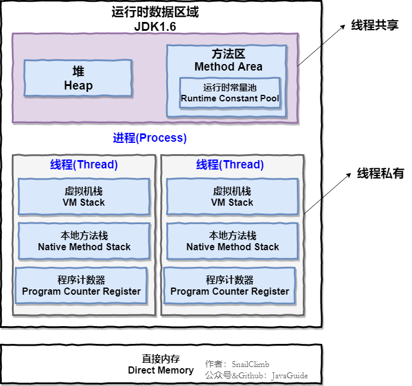
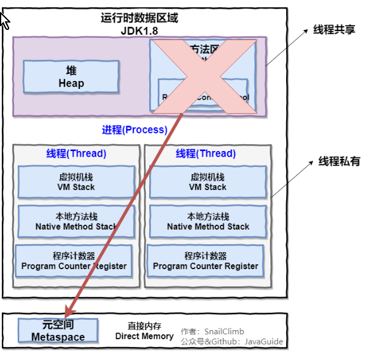
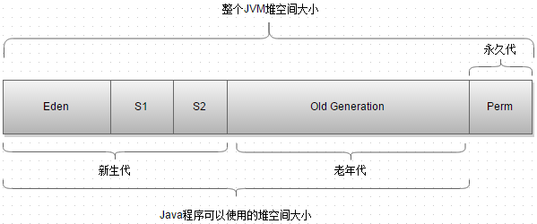
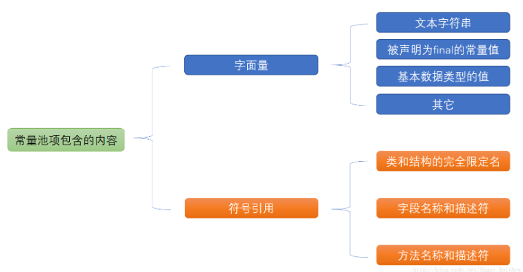
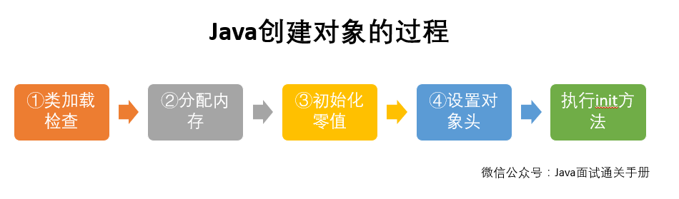
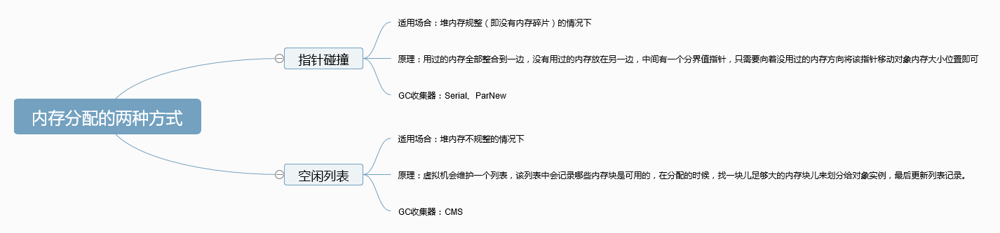

# Java内存知识梳理

## Java运行时内存区域划分

线程私有：

- 程序计数器
- 虚拟机栈
- 本地方法栈

线程共享的：

- 堆
- 方法区
- 直接内存

## 程序计数器
程序计数器是一块较小的内存空间，可以看做是当前线程所执行的字节码的**行号指示器**，且是**唯一一个不会出现OutOfMemoryError的内存区域**，生命周期和线程保持一致。
作用：

- 字节码解释器通过改变程序计数器来依次读取指令，从而实现代码的流程控制。
- 在多线程的情况下，程序计数器用于记录当前线程执行的位置。

## 虚拟机栈
- Java虚拟机栈的生命周期和线程一致，也称**栈内存**或虚拟机栈中**局部变量表**部分。实际上，Java虚拟机栈是由一个个栈帧组成，而每个栈帧都拥有：局部变量表、操作数栈、动态链接、方法出口信息。局部变量表主要存放了**编译器可知的各种数据类型**和**对象引用**。
- Java虚拟机栈会出的两种异常：StackOverFlowError和OutOfMemoryError。
    StackOverFlowError: 若Java虚拟机栈的内存大小不允许动态扩展，那么当线程请求栈的深度超过当前Java虚拟机栈的最大深度时，就抛出此异常。
    OutOfMemoryError: 若Java虚拟机栈的内存大小允许动态扩展，且当前线程请求栈时内存用完了，无法在动态扩展了，就会抛出此异常。
## 本地方法栈和虚拟机栈的区别
- 虚拟机栈为虚拟机执行Java方法(也就是字节码)服务。
- 本地方法栈则为虚拟机使用到的Native方法服务。
- 在HotSpot虚拟机中和Java虚拟机栈合二为一。

## 堆
Java堆是所有线程共享的一块内存区域，**此区域存在的唯一目的就是存放对象实例，几乎所有的对象实例以及数组都在这里分配内存**。也被称为**GC堆**，按照分代垃圾回收算法，Java堆可分为：新生代和老年代，再细致点可分为：Eden空间、From Survivor、To Survivor空间等。**进一步划分的目的是更好地回收内存，或者更快地分配内存**。

在JDK1.8中移除了整个永久代，取而代之的是一个叫**元空间(Metaspace)**的区域(永久代使用的是JVM的堆内存空间，而元空间使用的是物理内存，直接受到本机的物理内存限制)。

## 方法区
- 方法区用于存储**已被虚拟机加载的类信息、常量、静态变量、即时编译器编译后的代码等数据**。又称**Non-Heap(非堆)**，目的应该是与Java堆区分开来。相对而言，垃圾收集行为在这个区域是比较少出现的，但并非数据进入方法区后就“永久存在”了。
- 运行时常量池是方法区的一部分。Class文件中除了类的版本、字段、方法、接口等描述信息外，还有常量池信息(用于存放编译器生成的各种**字面量**和**符号引用**)。JDK1.7及之后版本的JVM已经**将运行时常量池从方法区移了出来，在Java堆(Heap)中开辟了一块区域存放运行时常量池**。

## 直接内存
- 直接内存并不是虚拟机运行时数据的一部分，也不是虚拟机规范中定义的内存区域，但是这部分内存也被频繁地使用，而且也可能导致OutOfMemoryError异常出现。
- JDK1.4中新加入的NIO(New Input/Output)类，引入了一种基于通道(Channel)与缓存区(Buffer)的I/O方式，它可以使用Native函数库直接分配堆外内存，然后通过一个存储在Java堆中的DirectByteBuffer对象作为这块内存的引用进行操作。这样就能在一些场景中显著提高性能，因为避免了在Java堆和Native堆之间来回复制数据。本机直接内存的分配不会受到Java堆的限制，但是，既然是内存就会受到本机总内存大小以及处理器寻址空间的限制。

## Java创建对象的过程

1. 类加载检查：虚拟机遇到一条new指令时，首先将去检查这个指令的参数是否能在常量池中定位到这个类的符号引用，并且检查这个符号引用代表的类是否被加载过、解析和初始化过。如果没有，那必须先执行相应的类加载过程。
2. 分配内存：在类检查通过后，接下来虚拟机将为新生对象分配内存。对象所需的内存大小在类加载完成后便可确定，为对象分配空间的任务等同于把一块确定大小的内存从Java堆中划分出来。分配方式有“指针碰撞”和“空闲列表”两种，选择哪种分配方式由Java堆是否规整决定，而Java堆是否规整又由所采用的垃圾收集器是否带有压缩整理功能决定。

3. 初始化零值：内存分配完成后，虚拟机需要将分配到的内存空间都初始化零值(不包括对象头)。
4. 设置对象头：初始化零值完成后，虚拟机要对对象进行必要的设置，例如对象实例对应的类、类的元数据信息位置、对象的哈希码、对象的GC分代年龄等信息。另外，根据虚拟机当前运行状态的不同，如是否启用偏向锁等，对象头会有不同的设置方式。
执行init方法：执行代码中的`<init>`方法。

## GC收集器的算法
- “标记-清除”
- “引用计数”
- “分代-复制”

## 虚拟机保证内存分配时的线程安全的两种方式

- CAS+失败重试：CAS是乐观锁的一种实现方式
- TLAB(Thread Local Allocation Buffer): 为每个线程预先在Eden区分配私有内存，JVM在给线程中的对象分配内存时，首先在TLAB分配，当对象大于TLAB中的剩余内存或TLAB的内存已用尽时，再采用上述的CAS进行内存分配。

## Hotspot虚拟机中，对象在内存中的布局
- 对象头：包含两部分信息，第一部分**用于存储对象自身的自身运行时数据**(哈希码、GC分代年龄、锁状态标志等等)，另一部分是**类型指针**，即对象指向它的类元数据的指针。
- 实例数据：**该部分是对象真正存储的有效信息**。
- 对齐填充：**该部分不是必然存在的，仅仅起占位作用**。因为Hotspot虚拟机的自动内存管理系统要求对象起始地址必须是8字节的整数倍，换句话说就是对象的大小必须是8字节的整数倍。而对象头部分正好是8字节的倍数(1倍或2倍)，因此，当对象实例数据部分没有对齐时，就需要通过对齐填充来补全。

## 目前主流的两种对象访问方式
- 句柄：Java堆中将会划分出一块内存来作为句柄池，reference中存储的就是对象的句柄地址，而句柄中包含了对象实例数据与类型数据格子的具体地址信息。好处是**在对象被移动时，无需更改reference中的句柄地址**。
- 直接指针：如果使用直接指针访问，那么Java堆对象的布局中就必须考虑如何放置访问类型数据的相关信息，而reference中存储的直接就是对象的地址。好处是**速度快，节省了一次指针定位的时间开销**。

## Java基本类型的包装类的缓存
Java基本类型的包装类**Byte,Short**,**Integer**,**Long**,**Character**,**Boolean**实现了常量池技术，这5种默认创建了数值**[-128, 127]**的相应类型的缓存数据，但是超出此范围仍然会去创建新的对象。**Float,Double** 并没有实现常量池技术。

references:
[1] [可能是把Java内存区域讲的最清楚的一篇文章](https://github.com/Snailclimb/JavaGuide/blob/3965c02cc0f294b0bd3580df4868d5e396959e2e/Java相关/可能是把Java内存区域讲的最清楚的一篇文章.md)