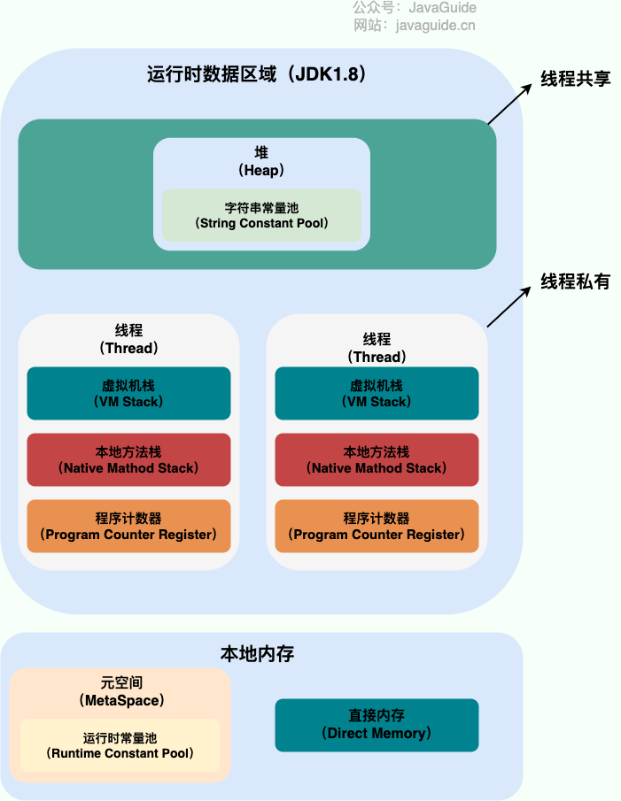

# Java内存知识梳理

## Java运行时内存区域划分

线程私有：

- 程序计数器
- 虚拟机栈
- 本地方法栈

线程共享的：

- 堆
- 方法区
- 直接内存

## 程序计数器
程序计数器用于记录当前线程执行代码的位置。

## 虚拟机栈
Java虚拟机栈服务于Java代码，由一个个栈帧组成，而每个栈帧都拥有：局部变量表、操作数栈、动态链接、方法出口等信息。局部变量表主要存放了**编译器可知的各种数据类型**和**对象引用**。

## 本地方法栈和虚拟机栈的区别
- 虚拟机栈为虚拟机执行Java方法(也就是字节码)服务。
- 本地方法栈则为虚拟机使用到的Native方法服务。
- 在HotSpot虚拟机中和Java虚拟机栈合二为一。

## 堆
Java堆是所有线程共享的一块内存区域，**此区域存在的唯一目的就是存放对象实例**。也被称为**GC堆**，按照分代垃圾回收算法，Java堆可分为：新生代和老年代，再细致点可分为：Eden空间、From Survivor、To Survivor空间等。**进一步划分的目的是更好地回收内存，或者更快地分配内存**。

在JDK1.8中移除了整个永久代，取而代之的是一个叫**元空间(Metaspace)**的区域(永久代使用的是JVM的堆内存空间，而元空间使用的是物理内存，直接受到本机的物理内存限制)。

### JVM垃圾回收的过程
大部分情况，对象都会首先在 Eden 区域分配，在一次新生代垃圾回收后，如果对象还存活，则会进入 S0 或者 S1，并且对象的年龄还会加 1(Eden 区->Survivor 区后对象的初始年龄变为 1)，当它的年龄增加到一定程度，就会被晋升到老年代中。

## 方法区
方法区用于存储**已被虚拟机加载的类信息、常量、静态变量、即时编译器编译后的代码等数据**。

## 运行时常量池
Class文件中除了类的版本、字段、方法、接口等描述信息外，还有**常量池表**信息(用于存放编译器生成的各种**字面量**和**符号引用**)。常量池表会在类加载后存放到方法区的运行时常量池中。

## Java创建对象的过程

- 类加载检查：虚拟机遇到一条new指令时，首先会去检查这个指令的参数是否能在常量池中定位到这个类的符号引用，并且检查这个符号引用代表的类是否被加载、解析和初始化过。如果没有，那必须先执行相应的类加载过程。
- 分配内存：在类检查通过后，虚拟机将为新生对象分配内存。对象所需的内存大小在类加载完成后便可确定，为对象分配空间的任务等同于把一块确定大小的内存从Java堆中划分出来。分配方式有“指针碰撞”和“空闲列表”两种，选择哪种分配方式由Java堆是否规整决定，而Java堆是否规整又由所采用的垃圾收集器是否带有压缩整理功能决定。
- 初始化零值：根据类型，为对象中成员变量赋默认值。
- 设置对象头：初始化零值完成后，虚拟机要对对象进行必要的设置，例如对象实例对应的类、类的元数据信息位置、对象的哈希码、对象的GC分代年龄等信息。另外，根据虚拟机当前运行状态的不同，如是否启用偏向锁等，对象头会有不同的设置方式。
- 执行init方法：执行代码中的`<init>`方法。

## references:
[1] [Java内存区域详解（重点）](https://javaguide.cn/java/jvm/memory-area.html)