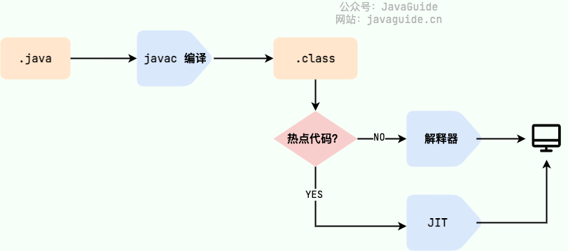

# Java基础知识梳理
尽量以简练而精确的内容对Java基础知识进行再梳理。

## 基础

### 特点

- 面向对象。
- 平台无关。
- 支持多线程。
- 自动内存管理。
- 编译与解释并存。

### 核心思想

#### 面向对象的特征
- 封装：隐藏具体实现，只对外提供**调用接口(函数)**。
- 继承：代码复用。
- 多态：在不影响原代码的情况下扩展程序以处理新情况的方法。核心是**动态绑定**（运行时确定类型，绑定对象）策略，即以实例的准确类型确定函数调用的绝对地址。

### 基础概念

#### 编译与解释并存
Java 语言既具有编译型语言的特征，也具有解释型语言的特征。由 Java 编写的程序需要先经过编译步骤，生成字节码（.class 文件），这种字节码必须由 Java 解释器来解释执行。

- JIT（Just in Time Compilation），属于运行时编译。当 JIT 完成第一次编译后，其会将字节码对应的机器码保存下来，下次可以直接使用。
-  AOT（Ahead of Time Compilation），这种编译模式会在程序被执行前就将其编译成机器码，属于静态编译。
    - 优点：
        - 避免了 JIT 预热等各方面的开销，可以提高 Java 程序的启动速度，避免预热时间长
        - 能减少内存占用和增强 Java 程序的安全性（AOT 编译后的代码不容易被反编译和修改），特别适合云原生场景
    - 缺点：
        - AOT 编译无法支持 Java 的一些动态特性，如反射、动态代理、动态加载、JNI（Java Native Interface）等

### 基本语法

#### 方法

##### 重载与重写的区别
- 重载：方法名相同，参数列表不同。
- 重写：方法名相同，参数列表也相同，返回值和抛出异常的类型范围小于父类，访问修饰符大于父类(private方法不能重写)。

### 字符串

#### String为什么是不可变的
- 保存字符串的byte数组被 `final` 修饰且为**私有**的，并且`String` 类没有提供/暴露修改这个字符串的方法。
- `String` 类被 `final` 修饰导致其不能被继承，进而避免了子类破坏 String 不可变。

#### `String`使用`+`拼接的底层原理
`String`使用**+**和**+=**拼接字符串，底层实际就是通过`StringBuilder`的`append()`方法实现的。

#### StringBuffer和StringBuilder的区别
StringBuffer对方法加了同步锁，是线程安全的，而StringBuilder没有。

### 类

#### hashCode()和equals()
- `equals()`返回true时，`hashCode()`的返回值也必须相同 。
- `hashCode()`的返回值相同不代表`equals()`返回true。
- 重写了`equals()`就必须重写`hashCode()`。

### 异常处理

#### finally
当try语句和finally语句中都有return语句时，忽略try中的return而执行finally的。

#### Throwable

##### Exception

###### Checked
example:
- `IOException`
- `ClassNotFoundException`
- `FileNotFoundException`

###### Unchecked
example:
- `NullPointerException`
- `ArrayIndexOutOfBoundsException`

##### Error
example:
- `OutOfMemoryError`
- `StackOverFlowError`

### IO流

#### BIO

#### NIO
基于`Buffer`、`Channel`和`Selector`的**I/O多路复用**（底层是基于`select`/`epoll`系统调用，先确认内核数据是否准备就绪，再发起`read`调用）。
- `Buffer`(缓冲区)：用来读写数据的，读的时候将数据从`Channel`填充到`Buffer`中，写到的时候反过来。
- `Channel`(通道)：双向、可读可写的数据传输通道。
- `Selector`(选择器)：允许一个线程处理多个 Channel，基于事件驱动的 I/O 多路复用模型。所有的 Channel 都可以注册到 Selector 上，由 Selector 来分配线程来处理事件。

## 高级

### 集合
[Java容器知识梳理.md](./Java容器知识梳理.md)

### 泛型
泛型是一种用来让支持多种类型的通用代码避免类型异常、减少类型转换的工具。
优点：
1. **类型安全**： 泛型可以在编译期间检查类型安全。这意味着，如果您使用了不正确的类型，代码将无法编译，从而避免了在运行时遇到类型错误的情况。
2. **代码复用**：用泛型可以使代码更加通用和灵活。您可以编写一个通用方法，并使用不同的类型进行调用，在不同的地方重复使用该方法，以达到最大的代码重用。
3. **减少类型转换**：泛型能够减少不必要的类型转换，从而提高程序的性能。

### 注解
一种特殊的接口，通常结合反射进行使用。

### 反射
可以让我们在运行时分析类以及操作类中方法的一种工具。

### 并发
[并发知识梳理.md](./并发知识梳理.md)

### JVM
[Java内存知识梳理.md](./Java内存知识梳理.md)

## references
- [Java基础常见面试题总结(上)](https://javaguide.cn/java/basis/java-basic-questions-01.html)
- [Java基础常见面试题总结(中)](https://javaguide.cn/java/basis/java-basic-questions-02.html)
- [Java基础常见面试题总结(下)](https://javaguide.cn/java/basis/java-basic-questions-03.html)