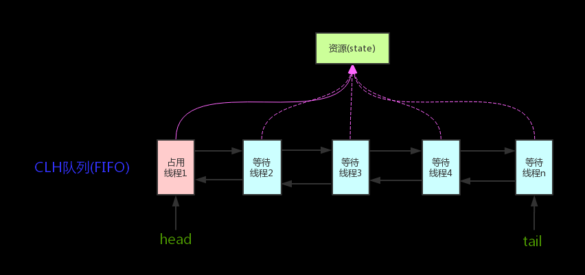

# 并发知识梳理

## 线程生命周期的6种状态


### 线程状态变迁


## 线程死锁
线程A占着资源1，想要资源2；线程B占着资源2，想要资源1。

避免死锁的方法：

- 一次性申请所有的资源。
- 占用部分资源的线程在申请不到其他资源时，主动释放占有的资源。
- 按序申请资源。（想申请资源2必须先申请资源1）

## sleep()和wait()的区别
- sleep没有释放锁，wait释放了锁。
- wait被调用后，线程不会自动恢复；sleep被调用后，线程会自动恢复。或者可以使用 wait(long timeout)超时后线程会自动恢复。

## synchronized
Java内置的同步锁关键字，用于多线程同步执行任务，被修饰的方法或代码块一次只能有一个线程执行。

### 使用方式

- 修饰实例方法：对当前对象实例加锁，只限制实例方法的同步执行
- 修饰静态方法：对当前类加锁，只限制静态方法的同步执行
- 修饰代码块：对指定对象加锁，限制代码块的同步执行

### 双重校验锁实现对象单例
```java
public class Singleton {

    private volatile static Singleton uniqueInstance;

    private Singleton() {
    }

    public static Singleton getUniqueInstance() {
       //先判断对象是否已经实例过，没有实例化过才进入加锁代码
        if (uniqueInstance == null) {
            //类对象加锁
            synchronized (Singleton.class) {
                if (uniqueInstance == null) {
                    uniqueInstance = new Singleton();
                }
            }
        }
        return uniqueInstance;
    }
}
```
因为`uniqueInstance = new Singleton();`实际是分3步执行的，而JVM的指令重排特性会导致顺序颠倒，使用`volatile`是为了禁止JVM的指令重排，保证多线程下能正常运行。

### 原理
synchronized 同步语句块的实现使用的是 monitorenter 和 monitorexit 指令，其中 monitorenter 指令指向同步代码块的开始位置，monitorexit 指令则指明同步代码块的结束位置。 当执行 monitorenter 指令时，线程试图获取锁也就是获取 monitor(monitor对象存在于每个Java对象的对象头中）。当计数器为0则可以成功获取，获取后将锁计数器设为1也就是加1。相应的在执行 monitorexit 指令后，将锁计数器设为0，表明锁被释放。如果获取对象锁失败，那当前线程就要阻塞等待，直到锁被另外一个线程释放为止。

### JDK1.6 之后的synchronized 关键字底层做的优化

- 偏向锁：如果在运行过程中，同步锁只有一个线程访问，不存在多线程竞争的情况，线程是不需要触发同步的，这种情况下，就会给线程加一个偏向锁。 如果在运行过程中，遇到了其他线程抢占锁的情况，则持有偏向锁的线程会被挂起，JVM会消除它身上的偏向锁，将锁升级为标准的轻量级锁。
- 轻量级锁：持有偏向锁的线程在遇到锁竞争的时候，偏向锁就会升级为轻量级锁。通过CAS实行加锁、解锁操作。
- 自旋锁：尝试获取锁的线程，在没有获得锁的时候，不被挂起，而是先执行一个空循环，即自旋。在若干个自旋后，如果还没有获得锁，就被挂起；如果获得了锁，则执行代码。
- 锁消除：编译时，如果检测到那些共享数据不可能存在多线程竞争，那么就执行锁消除。
- 锁粗化：如果一系列的连续操作都对同一个对象反复加锁和解锁(例如循环里有加锁代码)，那么加锁的范围就会扩展到这一系列操作的外部。

### Synchronized 和 ReenTrantLock 的对比

- 两者都是可重入锁(可重复获取自己的内部锁)
- synchronized 依赖于 JVM内部实现 而 ReenTrantLock 则是JDK代码实现的
- ReenTrantLock 比 synchronized灵活
- Synchronized是非公平锁（可插队拿锁），ReenTrantLock可自定义，默认是非公平锁。

## 线程池

### 使用线程池的好处

- 可以重复利用保存的线程以减少资源消耗。
- 方便管理线程。


### ThreadPoolExecutor构造函数的参数

重要参数

- corePoolSize：最小保留的线程数量。
- maximumPoolSize：最大可以同时运行的线程数量。
- workQueue：存放待执行任务的队列。

其他参数

- keepAliveTime：当线程池中的线程数量大于 corePoolSize 的时候，如果这时没有新的任务提交，核心线程外的线程不会立即销毁，而是会等待，直到等待的时间超过了 keepAliveTime才会被回收销毁；
- unit：keepAliveTime 参数的时间单位。
- threadFactory：线程池创建新线程时用到的工厂类。
- handler：饱和策略。
    - ThreadPoolExecutor.AbortPolicy：抛出 RejectedExecutionException来拒绝新任务的处理。
    - ThreadPoolExecutor.CallerRunsPolicy：调用执行自己的线程运行任务，也就是直接在调用execute方法的线程中运行(run)被拒绝的任务，如果执行程序已关闭，则会丢弃该任务。因此这种策略会降低对于新任务提交速度，影响程序的整体性能。另外，这个策略喜欢增加队列容量。如果您的应用程序可以承受此延迟并且你不能丢弃任何一个任务请求的话，你可以选择这个策略。
    - ThreadPoolExecutor.DiscardPolicy： 不处理新任务，直接丢弃掉。
    - ThreadPoolExecutor.DiscardOldestPolicy： 此策略将丢弃最早的未处理的任务请求。

### 创建线程池的两种方式

- 通过`ThreadPoolExecutor`构造函数实现(推荐)。
- 通过`Executors`工具类实现，可创建3种类型的线程池(不推荐)：
    - FixedThreadPool：可指定大小和线程工厂，任务队列类型是`LinkedBlockingQueue`，使用默认饱和策略(AbortPolicy)。（极不推荐，`LinkedBlockingQueue`队列无上限，任务过多时会导致内存溢出）
    - SingleThreadExecutor：池中只有一个线程，可指定线程工厂，任务队列类型是`LinkedBlockingQueue`，使用默认饱和策略(AbortPolicy)。（极不推荐，`LinkedBlockingQueue`队列无上限，任务过多时会导致内存溢出）
    - CachedThreadPool：池中线程数无限制，可指定线程工厂，任务队列类型是`SynchronousQueue`，使用默认饱和策略(AbortPolicy)。(极不推荐，池中线程数无上限，任务过多会创建过多线程会导致内存溢出)

### `execute()`和`submit()`

- `execute()`方法用于提交不需要返回值的任务，所以无法判断任务是否被线程池执行成功与否；
- `submit()`方法用于提交需要返回值的任务。线程池会返回一个 Future 类型的对象，通过这个 Future 对象可以判断任务是否执行成功，并且可以通过 Future 的 get()方法来获取返回值，get()方法会阻塞当前线程直到任务完成，而使用 get（long timeout，TimeUnit unit）方法则会阻塞当前线程一段时间后立即返回，这时候有可能任务没有执行完。

### `shutdown()`和`shutdownNow()`

- `shutdown()`：关闭线程池，线程池的状态变为 SHUTDOWN。线程池不再接受新任务了，但是队列里的任务得执行完毕。
- `shutdownNow()`：关闭线程池，线程的状态变为 STOP。线程池会终止当前正在运行的任务，并停止处理排队的任务并返回正在等待执行的 List。

### `isShutDown()`和`isTerminated()`

- `isShutDown()`：当调用 shutdown() 方法后返回为 true。
- `isTerminated()`：当调用 shutdown() 方法后，并且所有提交的任务完成后返回为 true。

### 线程池大小确定公式

- CPU 密集型任务(N+1)： 这种任务消耗的主要是 CPU 资源，可以将线程数设置为 N（CPU 核心数）+1，比 CPU 核心数多出来的一个线程是为了防止线程偶发的缺页中断，或者其它原因导致的任务暂停而带来的影响。一旦任务暂停，CPU 就会处于空闲状态，而在这种情况下多出来的一个线程就可以充分利用 CPU 的空闲时间。
- I/O 密集型任务(2N)： 这种任务应用起来，系统会用大部分的时间来处理 I/O 交互，而线程在处理 I/O 的时间段内不会占用 CPU 来处理，这时就可以将 CPU 交出给其它线程使用。因此在 I/O 密集型任务的应用中，我们可以多配置一些线程，具体的计算方法是 2N。

## volatile关键字

### 作用

- 保证变量的可见性（每次都从主存中获取值）
- 防止指令重排序

## 并发编程的三个重要特性

- 原子性：一系列关联操作要么都执行成功，要么都不成功。
- 可见性：当一个线程对共享变量进行了修改，那么另外的线程都是立即可以看到修改后的最新值。
- 有序性：代码在执行的过程中的先后顺序，Java 在编译器以及运行期间的优化，代码的执行顺序未必就是编写代码时候的顺序。

## ThreadLocal

对于指定共享资源，为所有访问它的线程创建单独的副本以避免线程安全问题。

### 原理

每个Thread中都具备一个ThreadLocalMap，而ThreadLocalMap可以存储以ThreadLocal为key ，Object 对象为 value的键值对。ThreadLocal是将指定资源的副本存到访问它的线程下的ThreadLocalMap里了。

## CAS

### 定义

CAS是英文单词**Compare and Swap**的缩写，即比较并替换；CAS机制中涉及到3个操作数：内存值 V，期望值 A，要修改的新值B。更新一个变量的时候，当且仅当 V 的值等于 A时，CAS通过原子方式用新值B来更新V的值，否则不会执行任何操作（比较和替换是一个原子操作）。一般情况下是一个自旋操作，即不断的重试。

### 优缺点

- 优点：比synchronized性能好
- 缺点：
   1. 重试次数过多会导致CPU开销过大
   2. 不能保证代码块的原子性（只针对单一变量的原子性）
   3. ABA问题（当一个值从A变成B，又更新回A，普通CAS机制会误判通过检测，可通过引入版本号比较解决）

### 底层实现

通过unsafe类，使JVM访问底层操作系统实现硬件级别的原子操作。

## Atomic 原子类

所谓原子类就是具有原子操作特征的类。

### JUC 包中的原子类是哪4类

基本类型
使用原子的方式更新基本类型

AtomicInteger：整形原子类
AtomicLong：长整型原子类
AtomicBoolean：布尔型原子类

数组类型
使用原子的方式更新数组里的某个元素

AtomicIntegerArray：整形数组原子类
AtomicLongArray：长整形数组原子类
AtomicReferenceArray：引用类型数组原子类

引用类型

AtomicReference：引用类型原子类
AtomicStampedReference：原子更新引用类型里的字段原子类
AtomicMarkableReference ：原子更新带有标记位的引用类型

对象的属性修改类型

AtomicIntegerFieldUpdater：原子更新整形字段的更新器
AtomicLongFieldUpdater：原子更新长整形字段的更新器
AtomicStampedReference：原子更新带有版本号的引用类型。该类将整数值与引用关联起来，可用于解决原子的更新数据和数据的版本号，可以解决使用 CAS 进行原子更新时可能出现的 ABA 问题。

### 原理

原子类主要利用 CAS (compare and swap) + volatile 和 native 方法来保证原子操作，从而避免 synchronized 的高开销，提升了执行效率。

## AQS

AQS是一个用来构建锁和同步器的框架，使用AQS能简单且高效地构造出应用广泛的大量的同步器，比如我们提到的ReentrantLock。

### 核心思想

如果被请求的共享资源空闲，则将当前请求资源的线程设置为有效的工作线程，并且将共享资源设置为锁定状态。如果被请求的共享资源被占用，那么就需要一套线程阻塞等待以及被唤醒时锁分配的机制，这个机制AQS是用CLH队列锁实现的，即将暂时获取不到锁的线程加入到队列中。

> CLH（Craig,Landin,and Hagersten）队列是一个虚拟的双向队列（虚拟的双向队列即不存在队列实例，仅存在节点之间的关联关系）。AQS是将每条请求共享资源的线程封装成一个CLH锁队列的一个节点（Node）来实现锁的分配。



### 对资源的共享方式

- Exclusive(独占)：只有一个线程能执行，如`ReentrantLock`。又可分为公平锁和非公平锁：
    - 公平锁：按照线程在队列中的排队顺序，先到者先拿到锁
    - 非公平锁：当线程要获取锁时，无视队列顺序直接去抢锁，谁抢到就是谁的
- Share(共享)：多个线程可同时执行，如`CountDownLatch`、`Semaphore`、`CylicBarrier`、`ReadWriteLock`

### 设计模式

- AQS底层使用了模板方法模式。需要重写的AQS的模板方法如下：

```java
isHeldExclusively() // 该线程是否正在独占资源。只有用到condition才需要去实现它
tryAcquire(int) // 独占方式。尝试获取资源，成功则返回true，失败则返回false
tryRelease(int) // 独占方式。尝试释放资源，成功则返回true，失败则返回false
tryAcquireShared(int) // 共享方式。尝试获取资源。负数表示失败；0表示成功，但没有剩余可用资源；正数表示成功，且有剩余资源
tryReleaseShared(int) // 共享方式。尝试释放资源，成功则返回true，失败则返回false
```

### 组件

#### Semaphore

`Semaphore`(信号量)：是共享锁的一种实现，允许多个线程同时访问某个资源

- 有两种模式：
    - 公平模式，调用acquire的顺序就是获取许可证的顺序，遵循FIFO
    - 非公平模式，抢占式的，为默认模式

```java
// 对应两个模式的构造方法
public Semaphore(int permits) {
    sync = new NonfairSync(permits);
}

public Semaphore(int permits, boolean fair) {
    sync = fair ? new FairSync(permits) : new NonfairSync(permits);
}
```

##### 原理

它默认构造`AQS`的`state`为`permits`。当执行任务的线程数量超出`permits`，那么多余的线程将会被放入阻塞队列`Park`，并自旋判断`state`是否大于0。只有当`state`大于0的时候，阻塞的线程才能继续执行，此时先前执行任务的线程继续执行`release`方法，`release`方法使得`state`的变量会加1，那么自旋的线程便会判断成功。如此，每次只有最多不超过`permits`数量的线程能自旋成功，便限制了执行任务线程的数量

#### CountDownLatch

`CountDownLatch`(倒计时器)：用来协调多个线程之间的同步，可以让某一个线程等待直到倒计时结束，再开始执行

##### 原理

它默认构造AQS的state值为count。当线程使用`countDown()`方法时，其实使用了`tryReleaseShared`方法以`CAS`的操作来减少`state`，直至`state`为0。当调用`await()`方法的时候，如果`state`不为0，那就证明任务还没有执行完毕，`await()`方法就会一直阻塞，也就是说`await()`方法之后的语句不会被执行。然后`CountDownLatch`会自旋`CAS`判断`state == 0`，如果`state == 0`的话，就会释放所有等待的线程，`await()`方法之后的语句得到执行。

##### 典型用法

- 某一线程在开始运行前等待n个线程执行完毕。将`CountDownLatch`的计数器初始化为n：`new CountDownLatch(n)`，每当一个任务线程执行完毕，就将计数器减1`countDown()`，当计数器的值变为0时，在`CountDownLatch`上`await()`的线程就会被唤醒。一个典型应用场景就是启动一个服务时，主线程需要等待多个组件加载完毕，之后再继续执行

- 实现多个线程开始执行任务的最大并行性。注意是并行性，不是并发。强调的是多个线程在某一时刻同时开始执行。类似于赛跑，将多个线程放到起点，等待发令枪响，然后同时开跑。做法是初始化一个共享的`CountDownLatch`对象，将其计数器初始化为1：`new CountDownLatch(1)`，多个线程在开始执行任务前首先`await()`，当主线程调用`countDown()`时，计数器变为0，多个线程同时被唤醒。

##### 不足

- 是一次性的，计数器的值只能在构造方法中初始化一次，之后没有任何机制再次对其设置值，当`CountDownLatch`使用完毕后，它不能再次被使用。

#### CyclicBarrier

`CyclicBarrier`和`CountDownLatch`非常类似，它也可以实现线程间的技术等待，但是它的功能比`CountDownLatch`更加复杂和强大。主要应用场景和`CountDownLatch`类似

> `CountDownLatch`的实现是基于AQS的，而`CyclicBarrier`是基于`ReentrantLock`(`ReentrantLock`也属于`AQS`同步器)和`Condition`的

`CyclicBarrier`的字面意思是可循环使用(Cyclic)的屏障(Barrier)。它要做的事情是，让一组线程到达一个屏障(也可以叫同步点)时被阻塞，直到最后一个线程到达屏障时，屏障才会开门，所有被屏障拦截的线程才会继续干活。`CyclicBarrier`默认的构造方法是`CiclicBarrier(int parties)`，其参数标识屏障拦截的线程数量，每个线程调用`await`方法告诉`CyclicBarrier`我已经到达了屏障，然后当前线程被阻塞

```java
public CyclicBarrier(int parties) {
    this(parties, null);
}

// parties代表要拦截的线程的数量
// barrierAction代表屏障打开时，需要优先执行的任务
public CyclicBarrier(int parties, Runnable barrierAction) {
    if(parties <= 0) throw new IllegalArgumentException();
    this.parties = parties;
    this.count = parties;
    this.barrierCommand = barrierAction;
}
```

##### 应用场景

可以用于多线程计算数据，最后合并计算结果的应用场景。
比如我们用一个Excel保存了用户所有银行流水，每个Sheet保存一个账户近一年的每笔银行流水，现在需要统计用户的日均银行流水，先用多线程处理每个sheet里的银行流水，都执行完之后，得到每个sheet的日均银行流水，最后，再用barrierAction用这些线程的计算结果，计算出整个Excel的日均银行流水

###### 原理

`CyclicBarrier`内部通过一个`count`变量作为计数器，`count`的初始值为`parties`属性的初始化值，每当一个线程到了栅栏这里了，那么就将计数器减1。如果`count`值为0了，表示这是这一代最后一个线程到达栅栏，就尝试执行我们构造方法中输入的任务

##### 和CountDownLatch的区别

对于`CountDownLatch`来说，重点是“一个线程（多个线程）等待”，而其他的N个线程在完成“某件事情”之后，可以终止，也可以等待。
而对于`CyclicBarrier`，重点是多个线程，在任意一个线程没有完成，所有的线程都必须等待
`CountDownLatch`是计数器，线程完成一个记录一个，只不过计数不是递增而是递减，而`CyclicBarrier`更像是一个阀门，需要所有线程都到达，阀门才能打开，然后继续执行

## 悲观锁和乐观锁

- 悲观锁：每次去拿数据的时候都认为别人会修改，所以每次在拿数据的时候都会上锁，Java中synchronized和ReentrantLock等独占锁就是悲观锁思想的实现。悲观锁适用于写比较多的情况下（多写场景）。
- 乐观锁：每次去拿数据的时候都认为别人不会修改，所以不会上锁，但是在更新的时候会判断一下在此期间别人有没有去更新这个数据。乐观锁适用于写比较少的情况下（多读场景）。

### 乐观锁的2种实现方式

- 版本号机制
- CAS算法

### 乐观锁的缺点

- ABA 问题
- 自旋CAS如果长时间不成功，会给CPU带来非常大的执行开销。