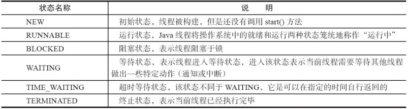
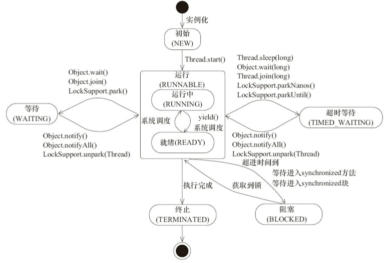
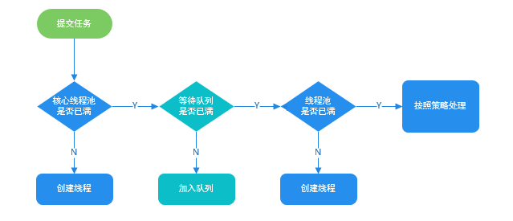

# 并发知识梳理

## 并发
多个任务交互执行；并行：多个任务同时进行。

## 使用多线程的好处
提高多核CPU利用率，提高系统整体的并发能力以及性能。

## 线程生命周期的6种状态


### 线程状态变迁


## 线程死锁
线程A占着资源1，想要资源2；线程B占着资源2，想要资源1。

避免死锁的方法：

- 一次性申请所有的资源。
- 占用部分资源的线程在申请不到其他资源时，主动释放占有的资源。
- 按序申请资源。（想申请资源2必须先申请资源1）

## sleep()和wait()的区别
- sleep没有释放锁，wait释放了锁。
- wait被调用后，线程不会自动恢复；sleep被调用后，线程会自动恢复。或者可以使用 wait(long timeout)超时后线程会自动恢复。

## 调用start()和调用run()的区别

- 调用start()后线程进入就绪状态，等到可以使用CPU时会自动调用run()。
- 调用run()相当于在当前线程中执行run()方法，并不是多线程执行。

## synchronized
Java内置的同步锁关键字，用于多线程同步执行任务，被修饰的方法或代码块一次只能有一个线程执行。

### 使用方式

- 修饰实例方法：对当前对象实例加锁，只限制实例方法的同步执行
- 修饰静态方法：对当前类加锁，只限制静态方法的同步执行
- 修饰代码块：对指定对象加锁，限制代码块的同步执行

### 双重校验锁实现对象单例
```java
public class Singleton {

    private volatile static Singleton uniqueInstance;

    private Singleton() {
    }

    public static Singleton getUniqueInstance() {
       //先判断对象是否已经实例过，没有实例化过才进入加锁代码
        if (uniqueInstance == null) {
            //类对象加锁
            synchronized (Singleton.class) {
                if (uniqueInstance == null) {
                    uniqueInstance = new Singleton();
                }
            }
        }
        return uniqueInstance;
    }
}
```
因为`uniqueInstance = new Singleton();`实际是分3步执行的，而JVM的指令重排特性会导致顺序颠倒，使用`volatile`是为了禁止JVM的指令重排，保证多线程下能正常运行。

### 原理
synchronized 同步语句块的实现使用的是 monitorenter 和 monitorexit 指令，其中 monitorenter 指令指向同步代码块的开始位置，monitorexit 指令则指明同步代码块的结束位置。 当执行 monitorenter 指令时，线程试图获取锁也就是获取 monitor(monitor对象存在于每个Java对象的对象头中）。当计数器为0则可以成功获取，获取后将锁计数器设为1也就是加1。相应的在执行 monitorexit 指令后，将锁计数器设为0，表明锁被释放。如果获取对象锁失败，那当前线程就要阻塞等待，直到锁被另外一个线程释放为止。

### JDK1.6 之后的synchronized 关键字底层做的优化

- 偏向锁：在此锁没有被其他线程获取的情况下，当前持有锁的线程不会做同步操作。
- 轻量级锁：通过CAS实行加锁、解锁操作。
- 自旋锁：获取CPU资源的线程在发现锁没有释放时会空转一段时间(例如一个空的for循环)以等待锁的释放，具体时间由JVM定。
- 锁消除：编译时，如果检测到那些共享数据不可能存在竞争，那么就执行锁消除。
- 锁粗化：如果一系列的连续操作都对同一个对象反复加锁和解锁(例如循环里有加锁代码)，那么加锁的范围就会扩展到这一系列操作的外部。

### Synchronized 和 ReenTrantLock 的对比

- 两者都是可重入锁(可重复获取自己的内部锁)
- synchronized 依赖于 JVM 而 ReenTrantLock 依赖于 API
- ReenTrantLock 比 synchronized灵活
- Synchronized是非公平锁（可插队拿锁），ReenTrantLock可自定义，默认是非公平锁。

## 线程池

### 使用线程池的好处

- 避免自由创建线程消耗过多资源。
- 方便管理线程。



### ThreadPoolExecutor构造函数的参数

重要参数

- corePoolSize：最小可以同时运行的线程数量。
- maximumPoolSize：最大可以同时运行的线程数量。
- workQueue：存放待执行任务的队列。

其他参数

- keepAliveTime：当线程池中的线程数量大于 corePoolSize 的时候，如果这时没有新的任务提交，核心线程外的线程不会立即销毁，而是会等待，直到等待的时间超过了 keepAliveTime才会被回收销毁；
- unit：keepAliveTime 参数的时间单位。
- threadFactory：线程池创建新线程时用到的工厂类。
- handler：饱和策略。
    - ThreadPoolExecutor.AbortPolicy：抛出 RejectedExecutionException来拒绝新任务的处理。
    - ThreadPoolExecutor.CallerRunsPolicy：调用执行自己的线程运行任务，也就是直接在调用execute方法的线程中运行(run)被拒绝的任务，如果执行程序已关闭，则会丢弃该任务。因此这种策略会降低对于新任务提交速度，影响程序的整体性能。另外，这个策略喜欢增加队列容量。如果您的应用程序可以承受此延迟并且你不能任务丢弃任何一个任务请求的话，你可以选择这个策略。
    - ThreadPoolExecutor.DiscardPolicy： 不处理新任务，直接丢弃掉。
    - ThreadPoolExecutor.DiscardOldestPolicy： 此策略将丢弃最早的未处理的任务请求。

### 创建线程池的两种方式

- 通过`ThreadPoolExecutor`构造函数实现(推荐)。
- 通过`Executors`工具类实现，可创建3种类型的线程池(不推荐)：
    - FixedThreadPool：可指定大小和线程工厂，任务队列类型是`LinkedBlockingQueue`，使用默认饱和策略(AbortPolicy)。（极不推荐，`LinkedBlockingQueue`队列无上限，任务过多时会导致内存溢出）
    - SingleThreadExecutor：池中只有一个线程，可指定线程工厂，任务队列类型是`LinkedBlockingQueue`，使用默认饱和策略(AbortPolicy)。（极不推荐，`LinkedBlockingQueue`队列无上限，任务过多时会导致内存溢出）
    - CachedThreadPool：池中线程数无限制，可指定线程工厂，任务队列类型是`SynchronousQueue`，使用默认饱和策略(AbortPolicy)。(极不推荐，池中线程数无上限，任务过多会创建过多线程会导致内存溢出)

### `execute()`和`submit()`
- `execute()`方法用于提交不需要返回值的任务，所以无法判断任务是否被线程池执行成功与否；
- `submit()`方法用于提交需要返回值的任务。线程池会返回一个 Future 类型的对象，通过这个 Future 对象可以判断任务是否执行成功，并且可以通过 Future 的 get()方法来获取返回值，get()方法会阻塞当前线程直到任务完成，而使用 get（long timeout，TimeUnit unit）方法则会阻塞当前线程一段时间后立即返回，这时候有可能任务没有执行完。

### `shutdown()`和`shutdownNow()`
- `shutdown()`：关闭线程池，线程池的状态变为 SHUTDOWN。线程池不再接受新任务了，但是队列里的任务得执行完毕。
- `shutdownNow()`：关闭线程池，线程的状态变为 STOP。线程池会终止当前正在运行的任务，并停止处理排队的任务并返回正在等待执行的 List。

### `isShutDown()`和`isTerminated()`
- `isShutDown()`：当调用 shutdown() 方法后返回为 true。
- `isTerminated()`：当调用 shutdown() 方法后，并且所有提交的任务完成后返回为 true。

### 线程池大小确定公式
- CPU 密集型任务(N+1)： 这种任务消耗的主要是 CPU 资源，可以将线程数设置为 N（CPU 核心数）+1，比 CPU 核心数多出来的一个线程是为了防止线程偶发的缺页中断，或者其它原因导致的任务暂停而带来的影响。一旦任务暂停，CPU 就会处于空闲状态，而在这种情况下多出来的一个线程就可以充分利用 CPU 的空闲时间。
- I/O 密集型任务(2N)： 这种任务应用起来，系统会用大部分的时间来处理 I/O 交互，而线程在处理 I/O 的时间段内不会占用 CPU 来处理，这时就可以将 CPU 交出给其它线程使用。因此在 I/O 密集型任务的应用中，我们可以多配置一些线程，具体的计算方法是 2N。

## volatile关键字

### 作用

- 保证变量的可见性
- 防止指令重排序

## 并发编程的三个重要特性

- 原子性：一系列关联操作要么都执行成功，要么都不成功。
- 可见性：当一个变量对共享变量进行了修改，那么另外的线程都是立即可以看到修改后的最新值。
- 有序性：代码在执行的过程中的先后顺序，Java 在编译器以及运行期间的优化，代码的执行顺序未必就是编写代码时候的顺序。

## ThreadLocal
对于指定共享资源，为所有访问它的线程创建单独的副本以避免线程安全问题。

### 原理
每个Thread中都具备一个ThreadLocalMap，而ThreadLocalMap可以存储以ThreadLocal为key ，Object 对象为 value的键值对。ThreadLocal是将指定资源的副本存到访问它的线程下的ThreadLocalMap里了。

### ThreadLocal 内存泄露问题
ThreadLocalMap 中使用的 key 为 ThreadLocal 的弱引用,而 value 是强引用。所以，如果 ThreadLocal 没有被外部强引用的情况下，在垃圾回收的时候，key 会被清理掉，而 value 不会被清理掉。这样一来，ThreadLocalMap 中就会出现key为null的Entry。假如我们不做任何措施的话，value 永远无法被GC 回收，这个时候就可能会产生内存泄露。ThreadLocalMap实现中已经考虑了这种情况，在调用 set()、get()、remove() 方法的时候，会清理掉 key 为 null 的记录。使用完 ThreadLocal方法后 最好手动调用remove()方法。

## CAS

### 定义
CAS是英文单词**Compare and Swap**的缩写，即比较并替换；CAS机制中使用了3个基本操作数：内存地址V，旧的预期值（更新前获取的值）A，要修改的新值B。更新一个变量的时候，只有当变量的预期值A和内存地址V当中的实际值相同时，才会将内存地址V对应的值修改为B。

### 优缺点

- 优点：比synchronized性能好
- 缺点：
   1. CPU开销过大（反复尝试更新变量但总不成功）
   2. 不能保证代码块的原子性（只针对单一变量的原子性）
   3. ABA问题（当一个值从A变成B，又更新回A，普通CAS机制会误判通过检测，可通过引入版本号比较解决）

### 底层实现
通过unsafe类，使JVM访问底层操作系统实现硬件级别的原子操作。