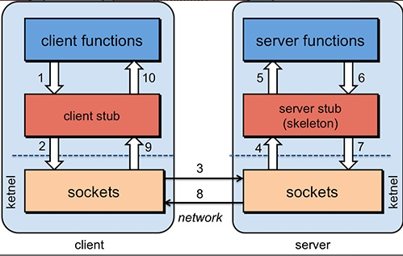
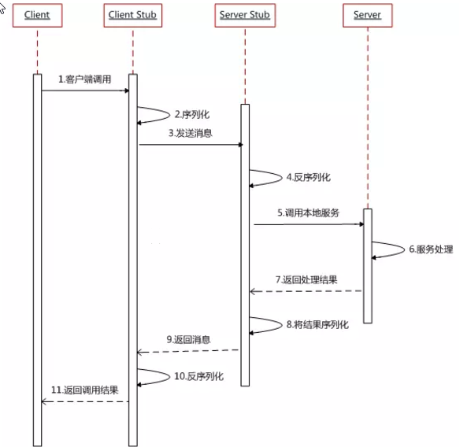
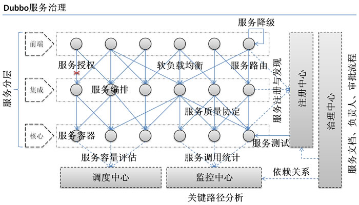
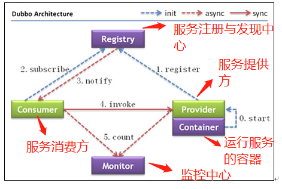
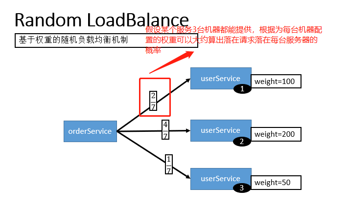
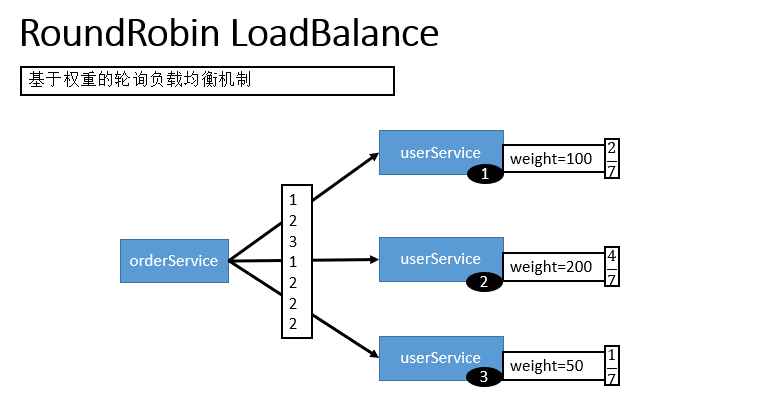

# Dubbo知识梳理

## 什么是Dubbo？

- `Dubbo`是一款高性能、轻量级的开源Java RPC框架，它提供了三大核心能力：面向接口的远程方法调用，智能容错和负载均衡，以及服务自动注册和发现。

## 什么是RPC？RPC原理是什么？

### 什么是RPC？

- `RPC(Remote Procedure Call)`，远程过程调用，它是一种通过网络从远程计算机程序上请求服务，而不需要了解底层网络技术的协议。

### RPC原理是什么？



1. 服务消费方(client)调用以本地调用方式调用服务；
2. `client stub`接口到调用后负责将方法、参数等组装成能够进行网络传输的消息体；
3. `client stub`找到服务地址，并将消息发送到服务端；
4. `server stub`收到消息后进行解码；
5. `server stub`根据解码结果调用本地的服务；
6. 本地服务执行并将结果返回给`server stub`；
7. `server stub`将返回结果打包成消息并发送至消费方；
8. `client stub`接收到消息，并进行解码；
9. 服务消费方得到最终结果；



## 为什么要用Dubbo？



可以从Dubbo提供的下面四点特性来说：
- 负载均衡——同一个服务部署在不同的机器时该调用哪一台机器上的服务。
- 服务调用链路生成——Dubbo可以为我们解决服务之间的调用关系问题。
- 服务访问压力以及时长统计、资源调度和治理——基于访问压力实时管理集群容量，提高集群利用率。
- 服务降级——某个服务挂掉之后调用备用服务。

## 什么事分布式？

- 分布式或者说SOA分布式重要的就是面向服务，说简单的分布式就是我们把整个系统拆分成不同的服务然后将这些服务放在不同的服务器上减轻单体服务的压力提高并发量和性能。

## 为什么要分布式？

- 从开发角度说，分布式系统的代码根据业务都拆分了，代码更便于维护和扩展；每个团队可以负责一个服务的开发，这样提升了开发效率。
- 分布式将系统拆分成不同的服务并单独部署，能提高系统性能。

## Dubbo架构

### 架构图解



#### 上述节点简单说明

- `Provider`：暴露服务的服务提供方
- `Consumer`：调用远程服务的服务消费方
- `Registry`：服务注册与发现的注册中心
- `Monitor`：统计服务的调用次数和调用时间的监控中心
- `Container`：服务运行容器

#### 调用关系说明

1. 服务容器负责启动，加载，运行服务提供者。
2. 服务提供者在启动时，向注册中心注册自己提供的服务。
3. 服务消费者在启动时，向注册中心订阅自己所需的服务。
4. 注册中心返回服务提供者地址列表给消费者，如果有变更，注册中心将基于长连接推送变更数据给消费者。
5. 服务消费者，从提供这地址列表中，基于软负载均衡算法，选一台提供者进行调用，如果调用失败，再选另一台调用。
6. 服务消费者和提供者，在内存中累计调动次数和调用时间，定时每分钟发送一次统计数据到监控中心。

#### 重要知识点总结

- 注册中心负责服务地址的注册于查找，相当于目录服务，服务提供者和消费者只在启动时与注册中心交互，注册中心不转发请求，压力较小
- 监控中心负责统计各服务调用次数，调用时间等，统计现在内存汇总后每分钟一次发送到监控中心服务器，并已报表展示
- 注册中心，服务提供者，服务消费者三者之间均为长连接，监控中心除外
- 注册中心通过长连接感知服务提供者的存在，服务提供者宕机，注册中心将立即推送事件通知消费者
- 注册中心和监控中心全部宕机，不影响已运行的提供者和消费者，消费者在本地缓存了提供者列表
- 注册中心和监控中心都是可选的，服务消费者可以直连服务提供者
- 服务提供者无状态，任意一台宕掉后，不影响使用
- 服务提供者全部宕掉后，服务消费者应用将无法使用，并无限次重连等待服务提供者恢复

### 工作原理


图中从下至上分为十层，各层均为单向依赖，右边的黑色箭头代表层之间的依赖关系，每一层都可以剥离上层被复用。其中，Service和Config层为API，其他各层均为SPI。

#### 各层说明

- 第一层：**service层**，接口层，给服务提供者和消费者来实现的
- 第二层：**config层**，配置层，主要是对dubbo进行各种配置的
- 第三层：**proxy层**，服务接口透明代理，生成服务的客户端`Stub`和服务器端`Skeleton`
- 第四层：**registry层**，服务注册层，负责服务的注册与发现
- 第五层：**cluster层**，集群层，封装多个服务提供者的路由以及负载均衡，将多个实例组合成一个服务
- 第六层：**monitor层**，监控层，对rpc接口的调用次数和调用时间进行监控
- 第七层：**protocol层**，远程调用层，封装rpc调用
- 第八层：**exchange层**，信息交换层，封装请求响应模式，同步转异步
- 第九层：**transport层**，网络传输层，抽象mina和netty为统一接口
- 第十层：**serialize层**，数据序列化层，网络传输需要

## Dubbo的负载均衡策略

在集群负载均衡时，Dubbo提供了多种均衡策略，默认为`random`随即调用，可以自行扩展负载均衡策略。

### Random LoadBalance(默认，基于权重的随机负载均衡机制)

- **随机，按权重设置随机概率**
- 在一个截面上碰撞的概率高，但调用量越大分布越均匀，而且按概率使用权重后也比较均匀，有利于动态调整提供者权重。



### RoundRobin LoadBalance(不推荐，基于权重的轮询负载均衡机制)

- 轮询，按公约后的权重设置轮询比率。
- 存在满的提供者累计请求的问题，比如：第二台机器很慢，但没挂，当请求调到第二台时就卡在那，久而久之，所有请求都卡在调到第二台上。



### LeastActive LoadBalance

- 最少活跃调用数，相同活跃数的随机，活跃数指调用前后计数差。
- 使慢的提供者收到更少请求，因为越慢的提供者的调用前后计数差会越大。

### ConsistentHash LoadBalance

- 一致性Hash，相同参数的请求总是发到同一提供者。（如果你需要的不是随机负载均衡，是要依赖请求都到一个节点，那就走这个一致性hash策略。）
- 当某一台提供者挂时，原本发往该提供者的请求，基于虚拟节点，平摊到其他提供者，不会引起剧烈变动。
- 缺省只对第一个参数Hash，如果要修改，请配置`<dubbo:parameter key="hash.arguments" value="0.1" />`
- 缺省用160份虚拟节点，如果要修改，请配置`<dubbo:parameter key="hash.nodes" value="320" />`

## zookeeper宕机与dubbo直连的情况

在实际生产中，假如zookeeper注册中心宕掉，一段时间内服务消费方还是能够调用提供方的服务的，实际上它使用的本地缓存进行通讯，这只是dubbo健壮性的一种体现。

### dubbo的健壮性表现

1. 监控中心宕掉不影响使用，只是丢失部分采样数据
2. 数据库宕掉后，注册中心仍能通过缓存提供服务列表查询，但不能注册新服务
3. 注册中心对等集群，任意一台宕掉后，将自动切换到另一台
4. 注册中心全部宕掉后，服务提供者和服务消费者仍能通过本地缓存通讯
5. 服务提供者无状态，任意一台宕掉后，不影响使用
6. 服务提供者全部宕掉后，服务消费者应用将无法使用，并无限次重连等待服务提供者恢复

注册中心负责服务地址的注册与查找，相当于目录服务，服务提供者和消费者只在启动时与注册中心交互，注册中心不转发请求，压力较小。所以，我们完全可以绕过注册中心——采用**dubbo直连**，即在服务消费方配置服务提供方的位置信息。

```
<!--xml配置方式-->

<dubbo:reference id="userService" interface="com.zang.gmall.service.UserService" url="dubbo://localhost:20880" />

// 注解方式
@Reference(url = "127.0.0.1:20880")
HelloService helloService;
```