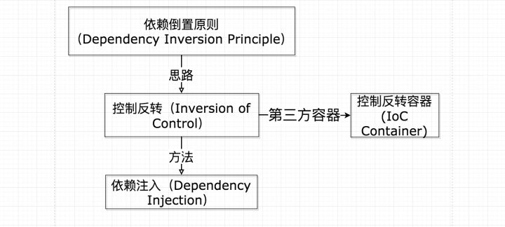
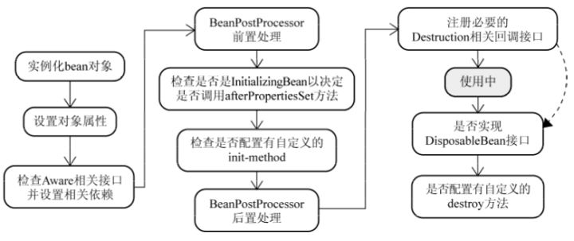

# Spring

## 静态代理

### 定义
指手动编写代理类以实现代理模式的方式。

### 三方关系梳理
代理类和委托类**实现同一个接口**，代理类和委托类是**组合**关系，只向调用类暴露代理方的方法。
在调用类和委托类(有多个)之间加入代理类，调用类调用代理类方法，代理类再调用委托类方法处理业务

### 有什么作用？
解除调用类和委托类的耦合关系，统一管理**同一种类型**的委托类。

### 优点和缺点
- 优点：
    - 调用类和委托类之间**解耦**，结构简单。
- 缺点：
    - 代理类和委托类实现了相同的接口，修改接口会导致代码成倍增加，增加维护难度。
    - 代理类只能管理**一种类型**的委托类，无法应对需要管理多种类型委托类的场景。

### 应用场景
扩展**同一种类型**的业务，以实现不同的功能。

## 动态代理
### 定义
在运行时创建指定类或接口的代理实例以实现代理模式的方式。

### 实现方式
- JDK动态代理：实现`InvocationHandler`接口并编写方法代理的逻辑，然后通过`java.lang.reflect`包中的`Proxy`类的`newProxyInstance`方法生成代理类实例。
    - 优点：简单高效
    - 缺点：被代理的类必须实现某一个接口

```java
public class DynamicProxyAgent {
    static interface ProxyInterface {
        void show();
    }

    static class ProxyClass implements ProxyInterface {
        @Override
        public void show() {
            System.out.println(String.format("%s runs real method: show()", this.getClass().getName()));
        }
    }

    static class MyProxyHandler implements InvocationHandler {
        private Object proxy;

        MyProxyHandler(Object proxy){
            this.proxy = proxy;
        }
        @Override
        public Object invoke(Object proxy, Method method, Object[] args) throws Throwable {
            System.out.println(String.format("%s runs logic before real method.", this.getClass().getName()));
            Object ret = method.invoke(this.proxy, args);
            System.out.println(String.format("%s runs logic after real method.", this.getClass().getName()));
            return ret;
        }
    }

    static Object agentWithJavaImplementation(Class interfaceClass, Object proxy) {
        return Proxy.newProxyInstance(interfaceClass.getClassLoader(), new Class[]{interfaceClass}, new MyProxyHandler(proxy));
    }

    public static void main(String[] args) {
        ProxyInterface proxy = (ProxyInterface) DynamicProxyAgent.agentWithJavaImplementation(ProxyInterface.class, new ProxyClass());
        proxy.show();
    }
}
```
- CGlib：实现`MethodInterceptor`接口并编写方法代理的逻辑，然后通过`Enhancer`类的`create()`方法生成代理类实例。
    - 优点：无需实现接口，任意类皆可
    - 缺点：内部实现复杂，效率比JDK要低

```java
public class DynamicProxyAgent {
    static class CGlibAgent implements MethodInterceptor{
        private Class proxy;

        CGlibAgent(Class proxy){
            this.proxy = proxy;
        }

        public Object getInstance(){
            Enhancer enhancer = new Enhancer();
            enhancer.setSuperclass(proxy);
            enhancer.setCallback(this);
            return enhancer.create();
        }

        @Override
        public Object intercept(Object obj, Method method, Object[] args, MethodProxy proxy) throws Throwable {
            System.out.println("before invoking...");
            Object ret = proxy.invokeSuper(obj, args);
            System.out.println("after invoking...");
            return ret;
        }
    }

    public static void main(String[] args) {
        CGlibAgent cGlibAgent = new CGlibAgent(ProxyClass.class);
        ProxyClass cgProxy = (ProxyClass)cGlibAgent.getInstance();
        cgProxy.show();
    }
}
```

### 优点和缺点
- 优点：调用类和委托类之间**解耦**，且可以用于多种类型委托类的场景，实现复杂程度随业务而定。
- 缺点：结构较复杂。

### 应用场景
- 日志系统、权限管理等通用业务场景。

## AOP

### 定义
**Aspect Oriented Programming**，即**面向切面编程**，指将**业务逻辑**和**系统服务**分离开来的一种软件开发方式。核心是**动态代理**。

### 基本概念
- 通知(Adivce)(5种)，声明代理方法以及执行时机
    - Before：在方法执行前调用
    - After：在方法执行后调用，无论方法是否执行成功
    - After-returning：在方法成功执行之后调用
    - After-throwing：在方法抛出异常后调用
    - Around：方法执行前和执行后都调用
- 切点(Pointcut): 目标方法
- 连接点(Join point)：目标方法的信息集合类
- 切面(Aspect)：代理方法信息集合类
- 引入(Introduction)：创建类代理对象
- 织入(Weaving)：创建方法代理对象

## IOC和DI

### 定义
**Inversion of Control**，控制反转，框架控制对象的创建；**Dependency Injection**，依赖注入，给标记的类字段赋值。

### 联系
**IOC**是**依赖倒置**原则的一种思路，**DI**则是**IOC**的一种具体实现方法。


### 延伸
依赖倒置原则：

- 细节依赖抽象。
- 低层模块依赖高层模块，两者皆依赖抽象。

## Spring Bean

### Spring中的Bean的作用域有哪些

- singleton : 单例bean实例，默认。
- prototype：每次请求都会创建一个新的bean实例。
- request：每一次HTTP请求都会产生一个新的bean，该bean仅在当前HTTP request内有效。
- session：每一次HTTP请求都会产生一个新的 bean，该bean仅在当前 HTTP session 内有效。

### Spring 中的单例 bean 的线程安全问题解决方法

- 在Bean对象中尽量避免定义可变的成员变量（不太现实）。
- 在类中定义一个ThreadLocal成员变量，将需要的可变成员变量保存在 ThreadLocal 中（推荐的一种方式）。

### Spring中声明bean的注解有哪些

- 作用于类：`@Component`、`@Repository`、`@Service`、`@Controller`、`RestController`
- 作用于方法：`@Bean`

### Spring中Bean的生命周期

- Bean 容器找到配置文件中 Spring Bean 的定义。
- Bean 容器利用 Java Reflection API 创建一个Bean的实例。
- 如果涉及到一些属性值 利用 `set()`方法设置一些属性值。
- 如果 Bean 实现了 `BeanNameAware` 接口，调用 `setBeanName()`方法，传入Bean的名字。
- 如果 Bean 实现了 `BeanClassLoaderAware` 接口，调用 `setBeanClassLoader()`方法，传入 `ClassLoader`对象的实例。
- 与上面的类似，如果实现了其他 *.Aware接口，就调用相应的方法。
- 如果有和加载这个 Bean 的 Spring 容器相关的 `BeanPostProcessor` 对象，执行`postProcessBeforeInitialization()` 方法
- 如果Bean实现了`InitializingBean`接口，执行`afterPropertiesSet()`方法。
- 如果 Bean 在配置文件中的定义包含 `init-method`属性，执行指定的方法。
- 如果有和加载这个 Bean的 Spring 容器相关的 `BeanPostProcessor` 对象，执行`postProcessAfterInitialization()` 方法
- 当要销毁 Bean 的时候，如果 Bean 实现了 `DisposableBean` 接口，执行 `destroy()` 方法。
- 当要销毁 Bean 的时候，如果 Bean 在配置文件中的定义包含 `destroy-method` 属性，执行指定的方法。


## SpringMVC

### SpringMVC 工作流程

- 客户端（浏览器）发送请求，直接请求到 `DispatcherServlet`。
- `DispatcherServlet` 根据请求信息调用 `HandlerMapping`，解析请求对应的 `Handler`。
- 解析到对应的 `Handler`（也就是我们平常说的 `Controller` 控制器）后，开始由 `HandlerAdapter` 适配器处理。
- `HandlerAdapter` 会根据 `Handler`来调用真正的处理器开处理请求，并处理相应的业务逻辑。
- 处理器处理完业务后，会返回一个 `ModelAndView` 对象，`Model` 是返回的数据对象，`View` 是个逻辑上的 `View`。
- `ViewResolver` 会根据逻辑 `View` 查找实际的 `View`。
- `DispaterServlet` 把返回的 `Model` 传给 `View`（视图渲染）。
- 把 `View` 返回给请求者（浏览器）。

## Spring 事务

### 2种配置方式

- 编程式事务，在代码中硬编码。(不推荐使用)
- 声明式事务，在配置文件中配置（推荐使用）
    - 基于XML
    - 基于注解

### 5种隔离级别

- TransactionDefinition.ISOLATION_DEFAULT: 使用后端数据库默认的隔离级别，Mysql 默认采用的 REPEATABLE_READ隔离级别。
- TransactionDefinition.ISOLATION_READ_UNCOMMITTED: 最低的隔离级别，允许读取尚未提交的数据变更，可能会导致脏读、幻读或不可重复读
- TransactionDefinition.ISOLATION_READ_COMMITTED: 允许读取并发事务已经提交的数据，可以阻止脏读，但是幻读或不可重复读仍有可能发生
- TransactionDefinition.ISOLATION_REPEATABLE_READ: 对同一字段的多次读取结果都是一致的，除非数据是被本身事务自己所修改，可以阻止脏读和不可重复读，但幻读仍有可能发生。
- TransactionDefinition.ISOLATION_SERIALIZABLE: 最高的隔离级别，完全服从ACID的隔离级别。所有的事务依次逐个执行，这样事务之间就完全不可能产生干扰，也就是说，该级别可以防止脏读、不可重复读以及幻读。但是这将严重影响程序的性能。通常情况下也不会用到该级别。

### 7种事务传播行为

- 支持当前事务的情况：
    - TransactionDefinition.PROPAGATION_REQUIRED： 如果当前存在事务，则加入该事务；如果当前没有事务，则创建一个新的事务。
    - TransactionDefinition.PROPAGATION_SUPPORTS： 如果当前存在事务，则加入该事务；如果当前没有事务，则以非事务的方式继续运行。
    - TransactionDefinition.PROPAGATION_MANDATORY： 如果当前存在事务，则加入该事务；如果当前没有事务，则抛出异常。
- 不支持当前事务的情况：
    - TransactionDefinition.PROPAGATION_REQUIRES_NEW： 创建一个新的事务，如果当前存在事务，则把当前事务挂起。
    - TransactionDefinition.PROPAGATION_NOT_SUPPORTED： 以非事务方式运行，如果当前存在事务，则把当前事务挂起。
    - TransactionDefinition.PROPAGATION_NEVER： 以非事务方式运行，如果当前存在事务，则抛出异常。
- 其他情况：
    - TransactionDefinition.PROPAGATION_NESTED： 如果当前存在事务，则创建一个事务作为当前事务的嵌套事务来运行；如果当前没有事务，则该取值等价于TransactionDefinition.PROPAGATION_REQUIRED。