# Spring Security

文档基于6.0.1版本撰写。

## Features

### Authentication

- `PasswordEncoder`接口用于将明文转换成密文。

- 推荐用单向的哈希函数对密码进行加密，且使用`salt`来避免[Rainbow Tables](https://zhuanlan.zhihu.com/p/105578739)问题。推荐的哈希函数有以下几种:
    - [bcrypt](https://docs.spring.io/spring-security/reference/6.0.1/features/authentication/password-storage.html#authentication-password-storage-bcrypt)
    - [PBKDF2](https://docs.spring.io/spring-security/reference/6.0.1/features/authentication/password-storage.html#authentication-password-storage-pbkdf2)
    - [scrypt](https://docs.spring.io/spring-security/reference/6.0.1/features/authentication/password-storage.html#authentication-password-storage-scrypt)
    - [argon2](https://docs.spring.io/spring-security/reference/6.0.1/features/authentication/password-storage.html#authentication-password-storage-argon2)

- Spring Security 5.0以前默认的`PasswordEncoder`是`NoOpPasswordEncoder`(不对明文密码做任何处理)，考虑到密码的历史迁移问题，推荐使用`DelegatingPasswordEncoder`(5.0以后默认的`PasswordEncoder`来应对存在多种加密方式的情况:

```java
// 获取默认的DelegatingPasswordEncoder
PasswordEncoder passwordEncoder = PasswordEncoderFactories.createDelegatingPasswordEncoder();
// 源码
public static PasswordEncoder createDelegatingPasswordEncoder() {
    String encodingId = "bcrypt";
    Map<String, PasswordEncoder> encoders = new HashMap();
    encoders.put(encodingId, new BCryptPasswordEncoder());
    encoders.put("ldap", new LdapShaPasswordEncoder()); // Deprecated
    encoders.put("MD4", new Md4PasswordEncoder()); // Deprecated
    encoders.put("MD5", new MessageDigestPasswordEncoder("MD5")); // Deprecated
    encoders.put("noop", NoOpPasswordEncoder.getInstance()); // Deprecated
    encoders.put("pbkdf2", Pbkdf2PasswordEncoder.defaultsForSpringSecurity_v5_5()); // Deprecated
    encoders.put("pbkdf2@SpringSecurity_v5_8", Pbkdf2PasswordEncoder.defaultsForSpringSecurity_v5_8());
    encoders.put("scrypt", SCryptPasswordEncoder.defaultsForSpringSecurity_v4_1()); // Deprecated
    encoders.put("scrypt@SpringSecurity_v5_8", SCryptPasswordEncoder.defaultsForSpringSecurity_v5_8());
    encoders.put("SHA-1", new MessageDigestPasswordEncoder("SHA-1")); // Deprecated
    encoders.put("SHA-256", new MessageDigestPasswordEncoder("SHA-256")); // Deprecated
    encoders.put("sha256", new StandardPasswordEncoder()); // Deprecated
    encoders.put("argon2", Argon2PasswordEncoder.defaultsForSpringSecurity_v5_2()); // Deprecated
    encoders.put("argon2@SpringSecurity_v5_8", Argon2PasswordEncoder.defaultsForSpringSecurity_v5_8());
    return new DelegatingPasswordEncoder(encodingId, encoders);
}
```

- 使用`DelegatingPasswordEncoder`加密后的密码格式为`{id}encodedPassword`,`id`是用户自定义的加密函数类型标识:

```
# Example
{bcrypt}$2a$10$dXJ3SW6G7P50lGmMkkmwe.20cQQubK3.HZWzG3YB1tlRy.fqvM/BG
{noop}password
{pbkdf2}5d923b44a6d129f3ddf3e3c8d29412723dcbde72445e8ef6bf3b508fbf17fa4ed4d6b99ca763d8dc
{scrypt}$e0801$8bWJaSu2IKSn9Z9kM+TPXfOc/9bdYSrN1oD9qfVThWEwdRTnO7re7Ei+fUZRJ68k9lTyuTeUp4of4g24hHnazw==$OAOec05+bXxvuu/1qZ6NUR+xQYvYv7BeL1QxwRpY5Pc=
{sha256}97cde38028ad898ebc02e690819fa220e88c62e0699403e94fff291cfffaf8410849f27605abcbc0
```

### Protection Against Exploits

#### CSRF

- [Cross Site Request Forgery (CSRF)](https://en.wikipedia.org/wiki/Cross-site_request_forgery)，跨站请求伪造，可通过以下两种方式防护:
    - [Synchronizer Token Pattern](https://docs.spring.io/spring-security/reference/6.0.1/features/exploits/csrf.html#csrf-protection-stp)，添加token验证的机制。
    - [Samesite Attribute](https://docs.spring.io/spring-security/reference/6.0.1/features/exploits/csrf.html#csrf-protection-ssa)，在Http response header中配置`SameSite`以约束客户端在请求中对cookie的处理。

#### HTTP Headers

- Spring Security默认`HTTP Response Headers`如下:

```
Cache-Control: no-cache, no-store, max-age=0, must-revalidate
Pragma: no-cache
Expires: 0
X-Content-Type-Options: nosniff
Strict-Transport-Security: max-age=31536000 ; includeSubDomains
X-Frame-Options: DENY
X-XSS-Protection: 0
```

- Spring Security默认禁用`Cache-Control`以避免用户敏感信息被窃取。
- `X-Content-Type-Options: nosniff`：关闭资源嗅探以防范XSS攻击。
- `Strict-Transport-Security: max-age=3153600 ; includeSubDomains`：要求浏览器只能通过HTTPS访问。
- `X-Frame-Options: DENY`：禁止浏览器以frame的方式加载页面。
- `X-Xss-Protection: 1`：要求浏览器(仅限支持过滤XSS攻击的)打开XSS攻击过滤。
- `Content-Security-Policy: script-src https://trustedscripts.example.com; report-uri /csp-reportendpoint/`：只允许加载指定来源的脚本，并将违规行为报告至指定服务接口。
- `Content-Security-Policy-Report-Only: script-src 'self' https://trustedscripts.example.com; report-uri /csp-reportendpoint/`：将违规行为报告至指定服务接口但不限制加载违规脚本。
- `Referrer-Policy: same-origin`：当用户在浏览器上点击一个链接时，会产生一个HTTP请求，用于获取新的页面内容，而在该请求的报头中，会包含一个`Referrer`，用以指定该请求是从哪个页面跳转页来的，常被用于分析用户来源等信息。[^1]
- `Clear-site-Data: "cache", "cookies", "storage", "executionContexts"`：用于当返回的响应包含该响应头时，清理浏览器存储的数据，例如cookie，local storage。

```java
@Configuration
@EnableWebSecurity
public class WebSecurityConfig {

    @Bean
    public SecurityFilterChain filterChain(HttpSecurity http) throws Exception {
        http.
                headers(headers -> headers
                        // 配置cache control(默认enable)
                        .cacheControl(HeadersConfigurer.CacheControlConfig::disable)
                        // 配置content type options((默认enable))
                        .contentTypeOptions(HeadersConfigurer.ContentTypeOptionsConfig::disable)
                        // 配置HSTS(除preload以外别的与默认一样)
                        .httpStrictTransportSecurity(hsts -> hsts
                                .includeSubDomains(true)
                                .preload(true)
                                .maxAgeInSeconds(31536009)
                        )
                        // 配置frame加载策略(默认DENY)
                        .frameOptions(HeadersConfigurer.FrameOptionsConfig::sameOrigin
                        )
                        // 配置XSS防护(默认block为true)
                        .xssProtection(xss -> xss
                                .headerValue(XXssProtectionHeaderWriter.HeaderValue.ENABLED_MODE_BLOCK)
                        )
                        // 配置CSP(默认不启用)
                        .contentSecurityPolicy(csp -> csp
                                .policyDirectives("script-src 'self' https://trustedscripts.example.com; object-src https://trustedplugins.example.com; report-uri /csp-report-endpoint/")
                                .reportOnly()
                        )
                        // 配置Referrer Policy(默认不启用)
                        .referrerPolicy(referrer -> referrer
                                .policy(ReferrerPolicyHeaderWriter.ReferrerPolicy.SAME_ORIGIN)
                        )
                        // 配置自定义响应头
                        .addHeaderWriter(new StaticHeadersWriter("X-Custom-Security-Header", "header-value"))
                )
                .logout((logout) -> logout
                        // 配置clear site Data(默认不启用)
                        .addLogoutHandler(new HeaderWriterLogoutHandler(new ClearSiteDataHeaderWriter(CACHE, COOKIES)))
                );
        return http.build();
    }
}
```

- 可以使用`DelegatingRequestMatcherHeaderWriter`针对匹配的路径返回Header。

```java
@EnableWebSecurity
public class WebSecurityConfig {

    @Bean
    public SecurityFilterChain filterChain(HttpSecurity http) throws Exception {
        RequestMatcher matcher = new AntPathRequestMatcher("/login");
        DelegatingRequestMatcherHeaderWriter headerWriter = new DelegatingRequestMatcherHeaderWriter(matcher, new XFrameOptionsHeaderWriter());
        http
                .headers(headers -> headers
                        .frameOptions(HeadersConfigurer.FrameOptionsConfig::disable)
                        .addHeaderWriter(headerWriter)
                );
        return http.build();
    }
}
```

### Integrations

#### Cryptography

- `Encryptors`用于提供构建对称加密的工厂方法。
- 使用`Encryptors.stronger`可以构建一个`BytesEncryptor`(可靠性更好，且加密后的数据唯一，推荐)：

```java
// salt是用来防止字典攻击
String salt = KeyGenerators.string().generateKey();
BytesEncryptor encryptor = Encryptors.stronger("password", salt);
byte[] secret = encryptor.encrypt("password1".getBytes());
System.out.println(new String(encryptor.decrypt(secret)));
// password1
```

- 使用`Encryptors.text`可以构建一个`TextEncryptor`(用于简单存储)：

```java
String salt = KeyGenerators.string().generateKey();
TextEncryptor textEncryptor = Encryptors .text("password", salt);
String textSecret = textEncryptor.encrypt("password1");
System.out.println(textEncryptor.decrypt(textSecret));
// password1
```

- `KeyGenerators`提供了获取多种key generators的方法且线程安全。
- `BytesKeyGenerator`用于生成`byte[]` key(默认长度为8，可自定义)，`StringKeyGenerator`用于生成`String` key(长度为8)。

```java
BytesKeyGenerator generator = KeyGenerators.secureRandom();
byte[] key = generator.generateKey();
System.out.println(key.length);
//8
// 每次生成不同的key
BytesKeyGenerator generator16 = KeyGenerators.secureRandom(16);
byte[] key16 = generator16.generateKey();
byte[] key16_1 = generator16.generateKey();
System.out.println(key16.length);
// 16
System.out.println("key16: " + new String(key16));
System.out.println("key16_1: " + new String(key16_1));
// key16 != key16_1

// 总是返回相同的key
BytesKeyGenerator generatorShared = KeyGenerators.shared(16);
byte[] keyShared = generatorShared.generateKey();
byte[] keyShared1 = generatorShared.generateKey();
System.out.println(keyShared.length);
// 16
System.out.println("keyShared: " + new String(keyShared));
System.out.println("keyShared1: " + new String(keyShared1));
// keyShared == keyShared1

StringKeyGenerator stringKeyGenerator = KeyGenerators.string();
String stringKey = stringKeyGenerator.generateKey();
System.out.println(stringKey.length());
//16
System.out.println("stringKey: " + stringKey);
```

- `BCryptPasswordEncoder`可以通过配置`strength`参数来提高安全性，代价是资源消耗更高。

```java
BCryptPasswordEncoder encoder = new BCryptPasswordEncoder(16);
String result = encoder.encode("myPassword");
assertTrue(encoder.matches("myPassword", result));
```

#### Spring Data

- Spring Data中集成依频`org.springframework.security:spring-security-data`提供bean `SecurityEvaluationContextExtension`，这样就能在`Query`的SQL中使用security相关的信息：

```java
@Bean
public SecurityEvaluationContextExtension securityEvaluationContextExtension() {
	return new SecurityEvaluationContextExtension();
}

@Repository
public interface MessageRepository extends PagingAndSortingRepository<Message,Long> {
	@Query("select m from Message m where m.to.id = ?#{ principal?.id }")
	Page<Message> findInbox(Pageable pageable);
}
```

#### Java's Concurrency APIs

- 可以通过配置返回bean `DelegatingSecurityContextExecutor`让异步线程共享相同的`Security Context`：

```java
@Bean
public Executor delegateSecurityContextExecutor() {
    SecurityContext context = SecurityContextHolder.createEmptyContext();
    Authentication authentication = UsernamePasswordAuthenticationToken.authenticated("user", "doesnotmatter", AuthorityUtils.createAuthorityList("ROLE_USER"));
    context.setAuthentication(authentication);
    SimpleAsyncTaskExecutor delegateExecutor = new SimpleAsyncTaskExecutor();
    return new DelegatingSecurityContextExecutor(delegateExecutor, context);
}

// example
@Autowired
private Executor executor; // becomes an instance of our DelegatingSecurityContextExecutor
public void submitRunnable() {
    Runnable originalRunnable = () -> {}; // invoke secured service
    executor.execute(originalRunnable);
}
```

## Servlet Applications

### Architecture

#### FilterChain

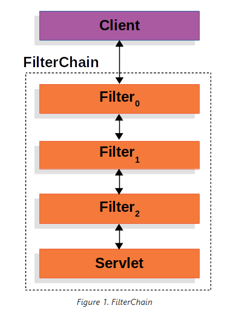

- Spring Security对`Servlet`的支持是基于`Servlet Filter`的，当程序接到client端发出的请求时，会创建一个`FilterChain`并包含`Filter`以及`Servlet`实例，来处理`HttpServletRequest`和`HttpServletResponse`:
    - 限制或匹配后续调用的`Filter`以及`Servlet`.
    - 修改将被后续调用的`Filter`以及`Servlet`使用的`HttpServletRequest`和`HttpServletResponse`。

```java
public void doFilter(ServletRequest request, ServletResponse response, FilterChain chain) {
	// do something before the rest of the application
    chain.doFilter(request, response); // invoke the rest of the application
    // do something after the rest of the application
}
```

> 因为`Filter`只会影响后续的`Filter`以及`Servlet`，所以`Filter`的调用顺序很重要。

#### DelegatingFilterProxy

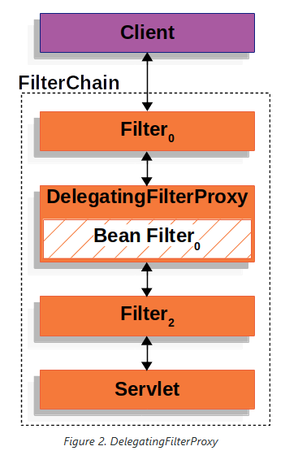

- Spring提供了一个名为`DelegatingFilterProxy`的`Filter`来桥接Servlet生命周期和Spring的`ApplicationContext`：
    - 遵循`Servlet`的方式注册`Filter`实例。
    - 能够将具体工作委托给Spring Bean处理。
    - 能够延迟加载Spring Bean以解决注册`Filter`在Spring加载Bean之前的问题。

```java
// DelegatingFilterProxy 伪代码逻辑
public void doFilter(ServletRequest request, ServletResponse response, FilterChain chain) {
	// Lazily get Filter that was registered as a Spring Bean
	// For the example in DelegatingFilterProxy delegate is an instance of Bean Filter0
	Filter delegate = getFilterBean(someBeanName);
	// delegate work to the Spring Bean
	delegate.doFilter(request, response);
}
```

#### FilterChainProxy

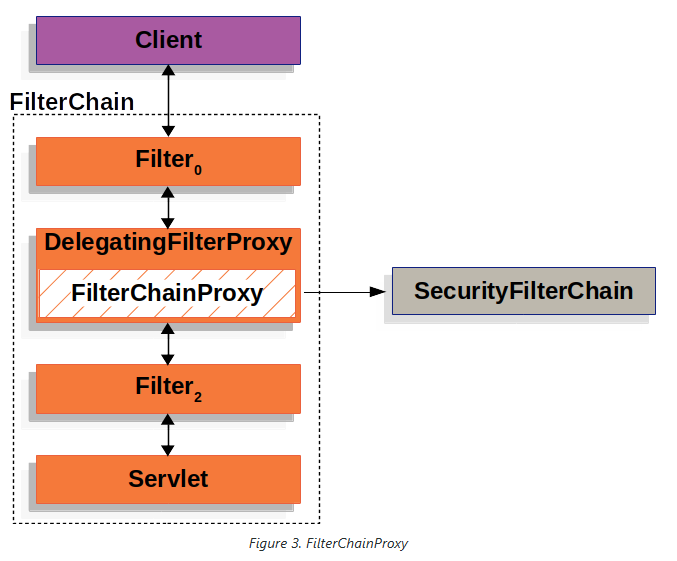

- Spring Security适配Servlet的关键是`FilterChainProxy`：
    - 由Spring Security提供的特殊`Filter`。
    - 能够通过`SecurityFilterChain`委托调用许多`Filter`实例。
    - 作为一个Bean包装在`DelegatingFilterProxy`中。

#### SecurityFilterChain

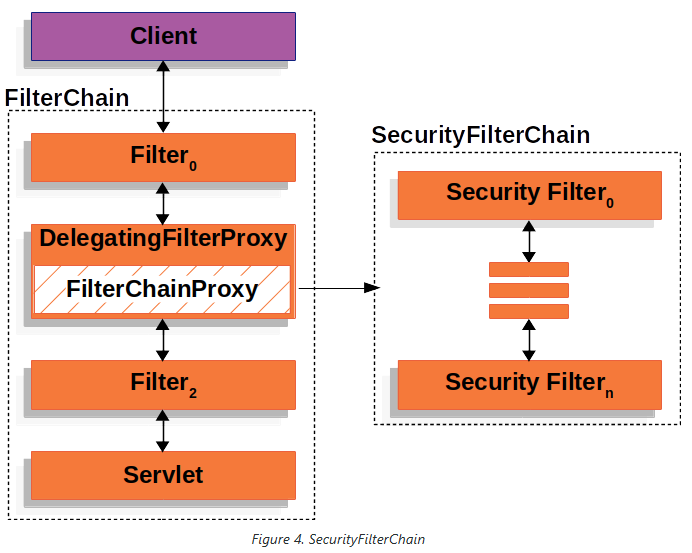

- `SecurityFilterChain`包含了一个Spring Security`Filter`集合，且提供了一个match方法来让调用的`FilterChainProxy`判断是否需要将该`Filter`集合应用到当前请求上。

```java
public interface SecurityFilterChain {
    boolean matches(HttpServletRequest request);

    List<Filter> getFilters();
}
```

- `SecurityFilterChain`通过`FilterChainProxy`注册Bean比直接通过Servlet容器和`DelegatingFilterProxy`注册多以下优点：
    - `FilterChainProxy`提供了Spring Security适配Servlet的起始点，所以对该类进行debug有利于追踪调试问题。
    - 因为`FilterChainProxy`是Spring Securty的核心，所以可以执行某些必要任务。例如清理`SecurityContext`避免内存泄漏，应用Spring Security的`HttpFirewall`来保护程序免受某些类型的攻击。
    - `FilterChainProxy`提供了更高的灵活性来决定何时调用`SecurityFilterChain`。通过`RequestMatcher`接口匹配`HttpServletRequest`中的任意信息来确定调用行为。

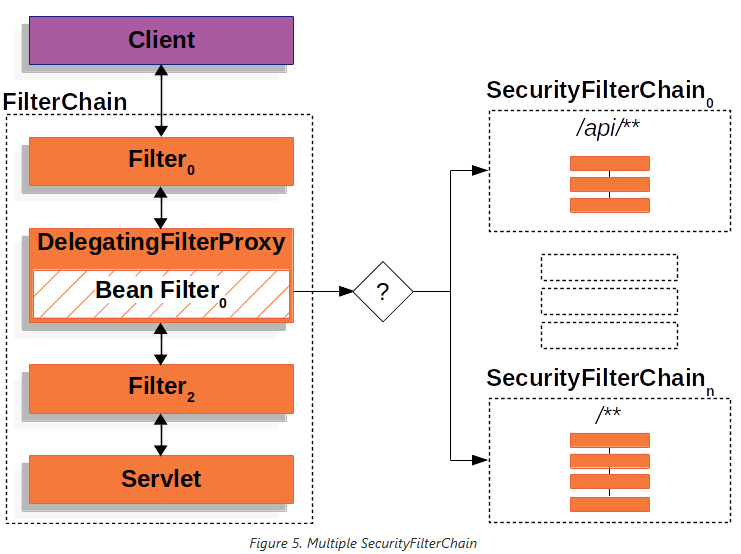

> 多个`SecurityFilterChain`之间是相互独立的，且包含的`Filter`数量可能不尽相同。

#### Security Filters

- 以下是按所有顺序调用的Spring Security `Filter`：

```
ForceEagerSessionCreationFilter
ChannelProcessingFilter
WebAsyncManagerIntegrationFilter
SecurityContextPersistenceFilter
HeaderWriterFilter
CorsFilter
CsrfFilter
LogoutFilter
OAuth2AuthorizationRequestRedirectFilter
Saml2WebSsoAuthenticationRequestFilter
X509AuthenticationFilter
AbstractPreAuthenticatedProcessingFilter
CasAuthenticationFilter
OAuth2LoginAuthenticationFilter
Saml2WebSsoAuthenticationFilter
UsernamePasswordAuthenticationFilter
DefaultLoginPageGeneratingFilter
DefaultLogoutPageGeneratingFilter
ConcurrentSessionFilter
DigestAuthenticationFilter
BearerTokenAuthenticationFilter
BasicAuthenticationFilter
RequestCacheAwareFilter
SecurityContextHolderAwareRequestFilter
JaasApiIntegrationFilter
RememberMeAuthenticationFilter
AnonymousAuthenticationFilter
OAuth2AuthorizationCodeGrantFilter
SessionManagementFilter
ExceptionTranslationFilter
FilterSecurityInterceptor
SwitchUserFilter
```

#### Handling Security Exceptions

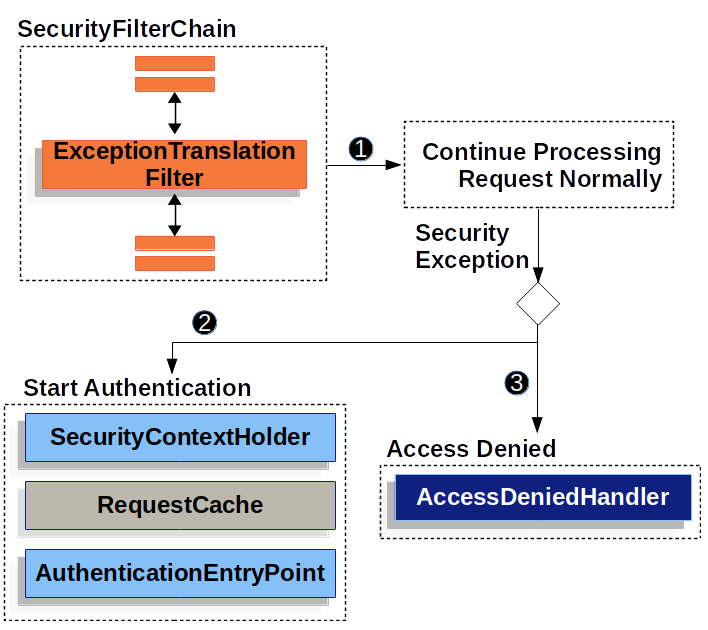

1. `ExceptionTranslationFilter`首先会调用`FilterChain.dofilter(request, response)`来执行程序。
2. 如果用户未验证或抛出的异常为`AuthenticationException`，则*Start Authentication*。
    1. 清空`SecurityContextHolder`。
    2. 缓存`HttpServletRequest`以供程序验证成功后重新响应原始请求。
3. 非步骤2的情况下，如果抛出的异常为`AccessDeniedException`，则*Access Denied*，同时调用`AccesDeniedHandler`。

> 如果程序抛出的异常不是`AuthenticationException`或`AccessDeniedException`，`ExceptionTranslationFilter`就不会做任何事。

#### Saving Requests Between Authentication

- `RequestCacheAwareFilter`将`HttpServletRequest`保存在`RequestCache`中。当用户成功验证后，将会使用`RequestCache`重新响应原始请求。
- `RequestCache`的默认实现是`HttpSessionRequestCache`，缓存请求时，会将其对应的`match parameter name`设置为`continue`，`session attribute name`设置为`SPRING_SECURITY_SAVED_REQUEST`；当获取缓存的请求时，同样会检查session中是否有key相同的request。

```java
// HttpSessionReguestcache
public HttpSessionRequestCache() {
    this.requestMatcher = AnyRequestMatcher.INSTANCE;
    this.sessionAttrName = "SPRING_SECURITY_SAVED_REQUEST";
    this.matchingRequestParameterName = "continue";
}

@Bean
DefaultSecurityFilterChain springSecurity(HttpSecurity http) throws Exception {
	HttpSessionRequestCache requestCache = new HttpSessionRequestCache();
	requestCache.setMatchingRequestParameterName("continue");
	http
		// ...
		.requestCache((cache) -> cache
			.requestCache(requestCache)
		);
	return http.build();
}
```

### Authentication

#### Authentication Architecture

##### Servlet Authentication Architecture

- `SecurityContextHolder`：`SecurityContextHolder`是Spring Security用来存储已认证用户信息的地方。
- `SecurityContext`：可以通过`SecurityContextHolder`获取，包含了当前已认证用户的信息。
- `Authentication`：既可以作为用户凭据传给`AuthenticationManager`对用户进行认证，也可以代表从`SecurityContext`获取的当前用户。
- `GrantedAuthority`：系统为`Authentication`中当前用户赋予的权限(例如role，scope等)。
- `AuthenticationManager`：定义Spring Security Filters具体认证逻辑的接口。
- `ProviderManager`：`AuthenticationManager`的通用实现。
- `AuthenticationProvider`：被`ProviderManager`用来针对特定方式进行认证的接口。
- `Request Credentials with AuthenticationEntryPoint`：用来向客户端请求认证信息的接口(例如重定向到登录页面，发送带有`WWW-Authenticate`请求头的相应等)。
- `AbstractAuthenticationProcessingFilter`：权限认证的基础`Filter`，为上层验证流程以及相互之间的合作方式提供了很好的思路。

##### SecurityContextHolder

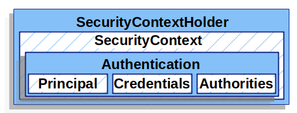

- `SecurityContextHolder`是Spring Security认证模型的核心，它包含了`SecurityContext`。
- Spring Security不关心`SecurityContextHolder`是如何构成的，只要它有值，该值就代表当前已认证的用户。

```java
// 表示用户已认证的最简单的方法就是直接给SecurityContextHolder赋值
SecurityContext context = SecurityContextHolder.createEmptyContext();
Authentication authentication =
    new TestingAuthenticationToken("username", "password", "ROLE_USER");
context.setAuthentication(authentication);

SecurityContextHolder.setContext(context);

// 获取当前已认证用户的信息
SecurityContext context = SecurityContextHolder.getContext();
Authentication authentication = context.getAuthentication();
String username = authentication.getName();
Object principal = authentication.getPrincipal();
Collection<? extends GrantedAuthority> authorities = authentication.getAuthorities();
```

- 默认情况下，`SecurityContextHolder`使用`ThreadLocal`存储认证信息，即在同一线程下运行的所有方法都可以在不显式传参的情况下获取`SecurityContext`。
- 同时Spring Security的`FilterChainProxy`会在完成请求后清理认证信息以确保安全。
-可以针对不用的情况对`SecurityContextHolder`存储认证信息的策略进行配置：

```java
// 源码
public class SecurityContextHolder {

	public static final String MODE_THREADLOCAL = "MODE_THREADLOCAL";

	public static final String MODE_INHERITABLETHREADLOCAL = "MODE_INHERITABLETHREADLOCAL";

	public static final String MODE_GLOBAL = "MODE_GLOBAL";

	private static final String MODE_PRE_INITIALIZED = "MODE_PRE_INITIALIZED";

	public static final String SYSTEM_PROPERTY = "spring.security.strategy";

	private static String strategyName = System.getProperty(SYSTEM_PROPERTY);

	private static SecurityContextHolderStrategy strategy;

	private static int initializeCount = 0;

	static {
		initialize();
	}

	private static void initialize() {
		initializeStrategy();
		initializeCount++;
	}

	private static void initializeStrategy() {
		if (MODE_PRE_INITIALIZED.equals(strategyName)) {
			Assert.state(strategy != null, "When using " + MODE_PRE_INITIALIZED
					+ ", setContextHolderStrategy must be called with the fully constructed strategy");
			return;
		}
		if (!StringUtils.hasText(strategyName)) {
			// Set default
			strategyName = MODE_THREADLOCAL;
		}
		if (strategyName.equals(MODE_THREADLOCAL)) {
			strategy = new ThreadLocalSecurityContextHolderStrategy();
			return;
		}
		if (strategyName.equals(MODE_INHERITABLETHREADLOCAL)) {
			strategy = new InheritableThreadLocalSecurityContextHolderStrategy();
			return;
		}
		if (strategyName.equals(MODE_GLOBAL)) {
			strategy = new GlobalSecurityContextHolderStrategy();
			return;
		}
		// Try to load a custom strategy
		try {
			Class<?> clazz = Class.forName(strategyName);
			Constructor<?> customStrategy = clazz.getConstructor();
			strategy = (SecurityContextHolderStrategy) customStrategy.newInstance();
		}
		catch (Exception ex) {
			ReflectionUtils.handleReflectionException(ex);
		}
	}
	...
}
```

##### Authentication

- `Authentication`接口主要用于两个方面：
    - 作为用户凭据传给`AuthenticationManager`对用户进行认证。此时，`isAuthenticated()`返回`false`。
    - 代表当前已认证用户，可通过`SecurityContext`获取。
- `Authentication`包含以下几部分：
    - `principal`：代表用户。当通过用户名/密码的方式进行认证时通常是`UserDetails`的实例对象。
    - `credentials`：通常是密码，多数情况会在用户认证完清空。
    - `authorities`：`GrantedAuthority`实例对象的集合，代表用户的权限，比如role，scope。

##### GrantedAuthority

- 可通过`Authentication.getAuthorities()`方法获得`GrantedAuthority`的实例对象集合。通常情况下被当做“roles”(比如`ROLE_ADMINISTRATOR`)，用作之后的认证。
- 当使用基于用户名/密码的认证方式时，一般是通过`UserDetailsService`加载`GrantedAuthority`。

##### ProviderManager

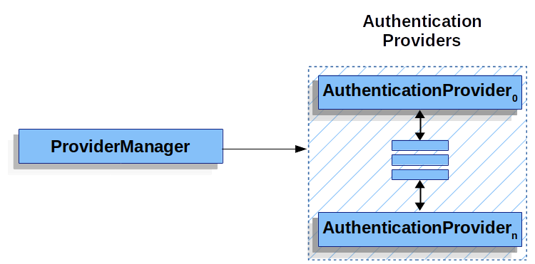

- `ProviderManager`是`AuthenticationManager`最通用的实现，它将实际认证流程委托给了一个`AuthenticationProvider`集合。每个`AuthenticationProvider`都有机会表明认证是否成功或需要委托给下一个`AuthenticationProvider`。如果没有配置任何`AuthenticationProvider`，就会抛出`ProviderNotFoundException`异常，表示没有支持当前`Authentication`类型的`ProviderManager`，并将认证结果标记为失败。这样做可以在只配置一个`AuthenticationManager`的同时，支持多种认证方式。

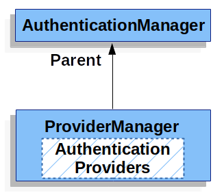
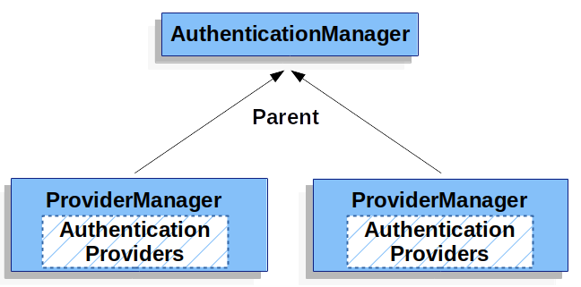

- `ProviderManager`可以配置一个可选的父`AuthenticationManager`，作为没有`AuthenticationProvider`可以进行认证的替代方案，通常就是`ProviderManager`实例。
- 多个`ProviderManager`也许会共享同一个父`AuthenticationManager`，但认证逻辑各不相同。
- 默认情况下，`ProviderManager`会清除成功认证后返回的`Authentication`包含的敏感信息，比如密码。但是这种做法在使用缓存的场景下会导致问题。当`Authentication`引用了缓存对象时，默认的清除行为会导致缓存对象不可再用于认证。解决这个问题最直接的方法就是对传递的对象进行拷贝，或者将`ProviderManager`中的`eraseCredentialsAfterAuthentication`设置为`false`。

##### AuthenticationProvider

- 每个`AuthenticationProvider`代表一种认证方式，`AuthenticationProvider`对象集合是构造`ProviderManager`对象的必要条件。

```java
    // ProviderManager源码
    public ProviderManager(AuthenticationProvider... providers) {
		this(Arrays.asList(providers), null);
	}

	/**
	 * Construct a {@link ProviderManager} using the given {@link AuthenticationProvider}s
	 * @param providers the {@link AuthenticationProvider}s to use
	 */
	public ProviderManager(List<AuthenticationProvider> providers) {
		this(providers, null);
	}

	/**
	 * Construct a {@link ProviderManager} using the provided parameters
	 * @param providers the {@link AuthenticationProvider}s to use
	 * @param parent a parent {@link AuthenticationManager} to fall back to
	 */
	public ProviderManager(List<AuthenticationProvider> providers, AuthenticationManager parent) {
		Assert.notNull(providers, "providers list cannot be null");
		this.providers = providers;
		this.parent = parent;
		checkState();
	}

	@Override
	public void afterPropertiesSet() {
		checkState();
	}

	private void checkState() {
		Assert.isTrue(this.parent != null || !this.providers.isEmpty(),
				"A parent AuthenticationManager or a list of AuthenticationProviders is required");
		Assert.isTrue(!CollectionUtils.contains(this.providers.iterator(), null),
				"providers list cannot contain null values");
	}
```

##### Request Credentials with AuthenticationEntryPoint

- `AuthenticationEntryPoint`是用来向client端索取认证凭据的，具体实现可以是重定向到登录界面，带有`WWW-Authenticate`请求头的响应或者其他行为。

##### AbstractAuthenticationProcessingFilter

- `AbstractAuthenticationProcessingFilter`是用于认证用户凭据的基础`Filter`。在认证之前，通常会通过`AuthenticationEntryPoint`请求凭据。

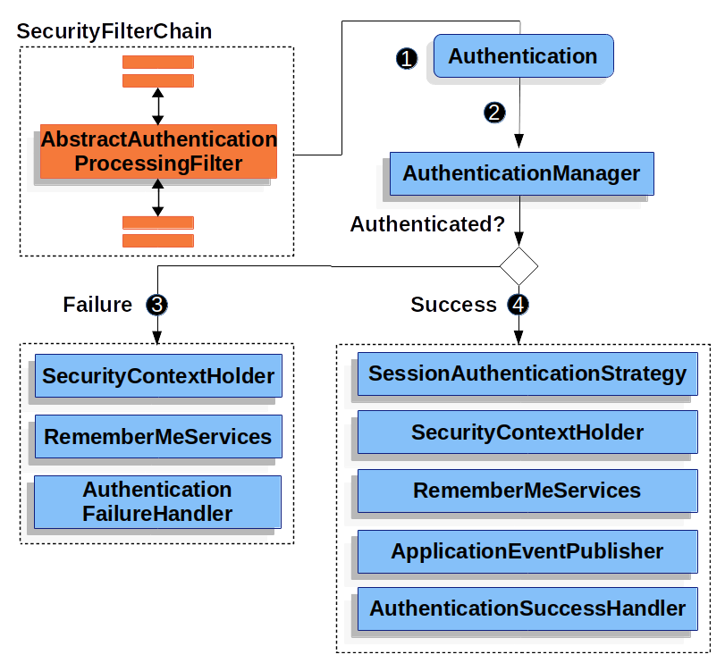

1. 

[^1]: [Referrer Policy 介绍](https://www.cnblogs.com/caixw/p/referrer-policy.html)