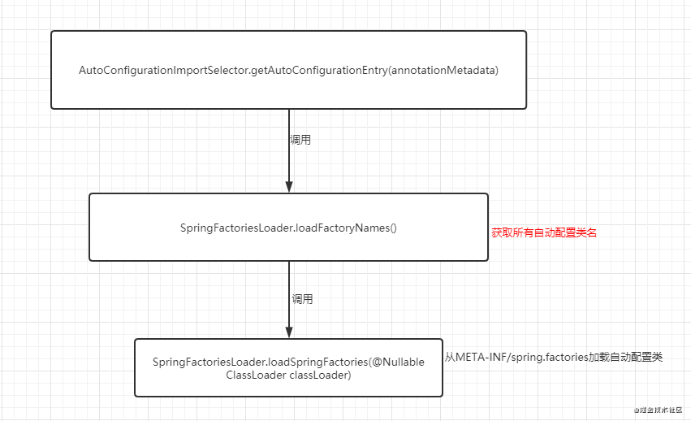

# Spring Boot
Spring Boot 是基于自Spring4开始有的条件注册的一套快速开发整合包。

## Spring Boot的优点

- 集成了多种默认配置，提高了开发效率。
- 使用依赖注解方式的`JavaConfig`可以避免复杂的XML配置。
- 内置嵌入式HTTP服务器，可以轻松地开发和测试Web程序。

## 什么是 Spring Boot Starter
Spring Boot Starter是一个服务于特定功能并处理好依赖关系的库集合，可直接引入使用。

## Spring Boot 自动装配的原理

### 什么是Spring Boot 自动装配

自动装配可以简单的理解为：**通过注解或者一些简单的配置就能在Spring Boot的帮助下实现某块功能**。

### Spring Boot是如何实现自动装配的

1. 对在main函数里调用了`SpringApplication.run()`的`XXX`class解析其注解识别`@SpringBootApplication`。
2. 根据`@SpringBootApplication`里包含的三个注解`@SpringBootConfiguration`、`@EnableAutoConfiguration`、`@ComponentScan`进行深度解析。
    1. `@Configuration`：允许在上下文中注册额外的bean或导入其他配置类
    2. `@ComponentScan`：扫描被`@Component`(`@Service`, `@Controller`)注解的bean，注解默认会扫描启动类所在的包下所有的类，可以自定义不扫描某些bean。
    3. `@EnableAutoConfiguration`：启用Spring Boot的自动装配机制
        1. 通过Spring 提供的 `@Import` 注解导入了`AutoConfigurationImportSelector`类（`@Import` 注解可以导入配置类或者Bean到当前类中）。
        2. `AutoConfigurationImportSelector`类实现了`ImportSelector`接口的`selectImports`方法，该方法主要用于**获取所有符合条件的类的全限定类名，这些类需要被加载到IoC容器中**。
            1. `selectImports`方法中调用`getAutoConfigurationEntry()`方法，加载自动配置类。
                1. 判断自动装配开关是否打开。默认`spring.boot.enableautoconfiguration=true`，可在`application.yml`或`application.properties`中设置。
                2. 获取`EnableAutoConfiguration`注解中的`exclude`和`excludeName`。
                3. 获取需要自动装配的所有配置类，读取所有Spring Boot Starter下的`META-INF/spring.factories`
                4. 根据配置类的注解`@ConditionalOnXXX`进行筛选，只注册满足条件的。

```java
// selectImports源码
private static final String[] NO_IMPORTS = new String[0];

public String[] selectImports(AnnotationMetadata annotationMetadata) {
        // <1>.判断自动装配开关是否打开
        if (!this.isEnabled(annotationMetadata)) {
            return NO_IMPORTS;
        } else {
          //<2>.获取所有需要装配的bean
            AutoConfigurationMetadata autoConfigurationMetadata = AutoConfigurationMetadataLoader.loadMetadata(this.beanClassLoader);
            AutoConfigurationImportSelector.AutoConfigurationEntry autoConfigurationEntry = this.getAutoConfigurationEntry(autoConfigurationMetadata, annotationMetadata);
            return StringUtils.toStringArray(autoConfigurationEntry.getConfigurations());
        }
    }
```


```java
// getAutoConfigurationEntry()源码
AutoConfigurationEntry getAutoConfigurationEntry(AutoConfigurationMetadata autoConfigurationMetadata, AnnotationMetadata annotationMetadata) {
        //<1>.
        if (!this.isEnabled(annotationMetadata)) {
            return EMPTY_ENTRY;
        } else {
            //<2>.
            AnnotationAttributes attributes = this.getAttributes(annotationMetadata);
            //<3>.
            List<String> configurations = this.getCandidateConfigurations(annotationMetadata, attributes);
            //<4>.
            configurations = this.removeDuplicates(configurations);
            Set<String> exclusions = this.getExclusions(annotationMetadata, attributes);
            this.checkExcludedClasses(configurations, exclusions);
            configurations.removeAll(exclusions);
            configurations = this.filter(configurations, autoConfigurationMetadata);
            this.fireAutoConfigurationImportEvents(configurations, exclusions);
            return new AutoConfigurationImportSelector.AutoConfigurationEntry(configurations, exclusions);
        }
    }
```