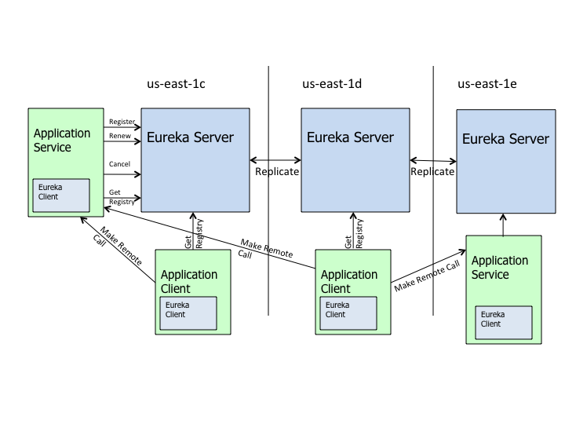

# Spring Cloud

## 什么是Spring Cloud

- Spring Cloud是微服务架构的一站式解决方案，使我们能在Spring Boot的基础上轻松地实现微服务项目的构建。


## 服务发现框架——Eureka



### 服务注册

- 当`Eureka`客户端向`Eureka Server`注册时，它提供自身的**元数据**，比如IP地址、端口，运行状况指示符URL，主页等。

### 服务续约

- `Eureka`客户端每隔30秒（默认情况下）发送一次心跳来续约。通过续约来告知`Eureka Server`该`Eureka`客户端仍然存在，没有出现问题。正常情况下，如果`Eureka Server`在90秒内没有收到`Eureka`客户端的续约，它会将实例从其注册表中删除。

### 获取注册表信息Fetch Registries：

- `Eureka`客户端从服务器获取注册表信息，并缓存在本地，用于查找其他服务，从而进行远程调用。该注册表信息定期（30秒）更新一次。如果由于某种原因导致注册表信息不能及时匹配，`Eureka`客户端则会重新获取整个注册表信息。`Eureka`客户端和`Eureka`服务器可以使用`JSON/XML`格式进行通信。在默认情况下`Eureka`客户端使用`JSON`格式来注册表信息。

### 服务下线Cancel

- `Eureka`客户端在程序关闭时向`Eureka`服务器发送取消请求。发送请求后，该客户端信息将从服务器的注册表中删除。该下线请求不会自动完成，他需要调用以下内容：`DiscoveryManager.getInstance().shutdownComponent()`。

### 服务剔除Eviction

- 在默认的情况下，当**Eureka客户端联系90秒（3个续约周期）没有向Eureka服务器发送服务续约，即心跳，Eureka服务器会将该服务实例从服务注册列表删除**，即服务剔除。

## 进程内负载均衡器——Ribbon

- `Ribbon`是一个客户端/进程内负载均衡器，运行在消费端。
- 其工作原理就是`Consumer`端获取到了所有的服务列表之后，在其内部使用负载均衡算法，均衡的对多个系统进行调用，以避免调用堵塞在某一个系统上而使集群失去高可用的作用。

### Ribbon与Nginx的区别

- `Nginx`是一种集中式的负载均衡器，它会**将所有的请求都集中起来，然后再进行负载均衡**；`Ribbon`则是在消费端进行负载均衡。


### Ribbon的几种负载均衡算法

- `RoundRobinRule`：轮询策略。默认采用。若经过一轮轮询后没有找到可用的`provider`，其最多轮询10次。若最终还没有找到，则返回`null`。
- `RandomRule`：随机策略。从所有可用的`provider`中随机选择一个。
- `RetryRule`：重试策略。先按照`RoundRobinRule`策略获取`provider`，若获取失败，则在指定时限内重试。默认的时限为500毫秒。
- 自定义负载均衡算法：实现`Rule`接口，然后修改配置文件或者自定义`Java Config`类。

> `Nginx`使用的是轮询和加权轮询算法。

## 服务调用映射——Open Feign

- `Open Feign`可以将被调用的服务代码映射到消费端，这样我们就可以直接使用。

> `Open Feign`也是运行在消费者端的，使用`Ribbon`进行负载均衡，所以`Open Feign`直接内置了`Ribbon`。

## 服务降级熔断器——Hystrix

### 熔断

- 指的是`Hystrix`中的**断路器模式**，可以使用简单的`@HystrixCommand`注解来标注某个方法，这样`Hystrix`就会使用**断路器**来“包装”这个方法，每当调用时间超过指定时间时（默认为1s），断路器将会中断对这个方法的调用。

### 降级

- 降级是为了更好的用户体验，当一个方法调用异常时，通过执行另一种代码逻辑来给用户友好的回复。即`Hystrix`的**后备处理**模式。

### 舱壁模式

- 在不使用舱壁模式的情况下，服务A调用服务B，这种调用默认的是**使用同一批线程来执行**的，而在一个服务出现性能问题的时候，就会出现所有线程被刷爆并等待处理工作，同时阻塞新请求，最终导致程序崩溃。而舱壁模式会将远程资源调用隔离在他们自己的线程池中，以便可以控制单个表现不佳的服务，而不会使程序崩溃。

## 微服务网管——Zuul

- 网关是系统唯一对外的入口，介于客户端与服务端之间，用于对请求进行**鉴权**、**限流**、**路由**、**监控**等功能。
- `Zuul`最关键的是**路由**和**过滤器**。


### Zuul的路由功能


#### 统一前缀

- 配置访问路径的统一前缀。

```yml
# example
zuul:
  prefix: /zuul
```

#### 路由策略配置

- 将微服务名称暴露给用户，会存在安全问题，可以自定义路径来替代微服务名称。

```yml
# example
zuul:
  routes:
    consumer1: /FrancisQ1/**
    consumer2: /FrancisQ2/**
```

#### 服务名屏蔽

- 配置完路由策略之后使用微服务名称还是可以访问的，此时需要将服务名屏蔽。

```yml
# example
zuul:
  ignore-services: "*"
```

#### 路径屏蔽

- 指定屏蔽掉的路径URI，只要用户请求中包含指定的URI路径，那么该请求将无法访问到指定的服务。通过该方式可以限制用户权限。

```yml
# example
zuul:
  ignore-patterns: **/auto/**
```

#### 敏感请求头屏蔽

- 默认情况下，像`Cookie`、`Set-Cookie`等敏感请求头信息会被`zuul`屏蔽掉，我们可以将这些默认屏蔽去掉，当然也可以添加要屏蔽的请求头。

### Zuul的过滤功能

- 通过过滤功能，我们能够实现**限流**、**灰度发布**、**权限控制**等。
- 要实现自定义的`Filter`我们只需要继承`ZuulFilter`然后将这个过滤器类以`@Component`注解加入Spring容器中。
- 过滤器类型：`Pre`、`Routing`、`Post`。
    - `Pre`：在请求之前进行过滤
    - `Routing`：根据路由策略过滤
    - `Post`：在`Response`之前进行过滤


## 统一配置中心——Config

- `Spring Cloud Config`能将各个应用/系统/模块的配置文件存放到**统一的地方然后进行管理**（Git或者SVN）。
- 一般我们会使用`Bus`消息总线+`Spring Cloud Config`进行配置的动态刷新。


## 消息总线——Bus

- `Spring Cloud Bus`的作用就是**管理和广播分布式系统中的消息**，也就是消息引擎系统中的广播模式。
- 我们只需要创建一个简单的请求，并且加上`@RefreshScope`注解就能进行配置的动态修改。


