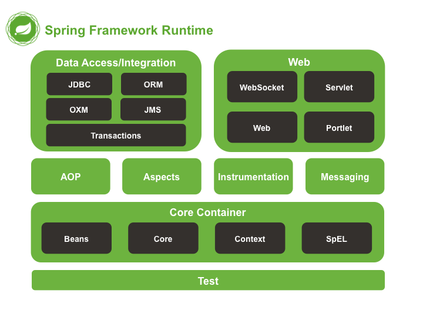
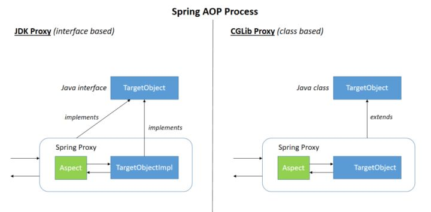
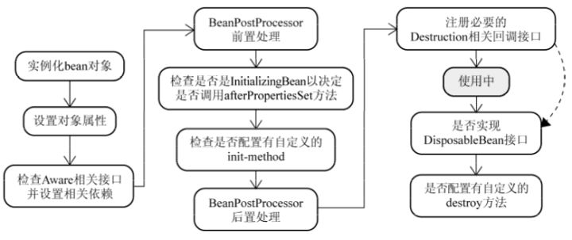

# Spring

## 重要模块

> 上图对应的是 Spring4.x 版本。目前最新的5.x版本中 Web 模块的 Portlet 组件已经被废弃掉，同时增加了用于异步响应式处理的 WebFlux 组件。

- Spring Core：基础，可以说Spring其他所有的功能都需要依赖于该类库。主要提供IoC依赖注入功能。
- Spring Aspects：该模块为与AspectJ的继承提供支持。
- Spring AOP：提供了面向切面的编程实现。
- Spring JDBC：Java数据库连接。
- Spring JMS：Java消息服务。
- Spring ORM：用于支持Hibernate等ORM工具。
- Spring Web：为创建Web应用程序提供支持。
- Spring Test：提供了对JUnit和TestNG测试的支持。

## IoC和AOP

### IoC

- IoC(Inverse of Control：控制反转)是一种设计思想，就是**将原本在程序中手动创建对象的控制权，交由Spring框架来管理**。
- IoC容器是Spring用来实现IoC的载体，**IoC容器实际上就是个Map，Map中存放的是各种对象**。
- IoC容器就像是一个工厂，当我们需要创建一个对象的时候，只需要配置好配置文件/注解即可，完全不用考虑对象是如何被创建出来的。

### AOP

- AOP(Aspect-Oriented Programming：面向切面编程)能够将那些与业务无关，**却为业务模块所共同调用的逻辑或责任（例如事务处理、日志管理、权限控制等）封装起来**，便于**减少系统的重复代码，降低模块间的耦合度**，并**有利于未来的可拓展性和可维护性**。
- 基于动态代理。

## Spring Bean

### Spring中的Bean的作用域有哪些

- singleton : 单例bean实例，默认。
- prototype：每次请求都会创建一个新的bean实例。
- request：每一次HTTP请求都会产生一个新的bean，该bean仅在当前HTTP request内有效。
- session：每一次HTTP请求都会产生一个新的 bean，该bean仅在当前 HTTP session 内有效。

### Spring 中的单例 bean 的线程安全问题解决方法

- 在类中定义一个ThreadLocal成员变量，将需要的可变成员变量保存在 ThreadLocal 中（推荐的一种方式）。

### Spring中声明bean的注解有哪些

- 作用于类：`@Component`、`@Repository`、`@Service`、`@Controller`、`RestController`
- 作用于方法：`@Bean`

### Spring中Bean的生命周期

- Bean 容器找到配置文件中 Spring Bean 的定义。
- Bean 容器利用 Java Reflection API 创建一个Bean的实例。
- 如果涉及到一些属性值 利用 `set()`方法设置一些属性值。
- 如果 Bean 实现了 `BeanNameAware` 接口，调用 `setBeanName()`方法，传入Bean的名字。
- 如果 Bean 实现了 `BeanClassLoaderAware` 接口，调用 `setBeanClassLoader()`方法，传入 `ClassLoader`对象的实例。
- 与上面的类似，如果实现了其他 *.Aware接口，就调用相应的方法。
- 如果有和加载这个 Bean 的 Spring 容器相关的 `BeanPostProcessor` 对象，执行`postProcessBeforeInitialization()` 方法
- 如果Bean实现了`InitializingBean`接口，执行`afterPropertiesSet()`方法。
- 如果 Bean 在配置文件中的定义包含 `init-method`属性，执行指定的方法。
- 如果有和加载这个 Bean的 Spring 容器相关的 `BeanPostProcessor` 对象，执行`postProcessAfterInitialization()` 方法
- 当要销毁 Bean 的时候，如果 Bean 实现了 `DisposableBean` 接口，执行 `destroy()` 方法。
- 当要销毁 Bean 的时候，如果 Bean 在配置文件中的定义包含 `destroy-method` 属性，执行指定的方法。

## SpringMVC

### SpringMVC 工作流程

- 客户端（浏览器）发送请求，直接请求到 `DispatcherServlet`。
- `DispatcherServlet` 根据请求信息调用 `HandlerMapping`，解析请求对应的 `Handler`。
- 解析到对应的 `Handler`（也就是我们平常说的 `Controller` 控制器）后，开始由 `HandlerAdapter` 适配器处理。
- `HandlerAdapter` 会根据 `Handler`来调用真正的处理器处理请求，并处理相应的业务逻辑。
- 处理器处理完业务后，会返回一个 `ModelAndView` 对象，`Model` 是返回的数据对象，`View` 是个逻辑上的 `View`。
- `ViewResolver` 会根据逻辑 `View` 查找实际的 `View`。
- `DispaterServlet` 把返回的 `Model` 传给 `View`（视图渲染）。
- 把 `View` 返回给请求者（浏览器）。

## Spring 事务

### 5种隔离级别

- TransactionDefinition.ISOLATION_DEFAULT: 使用后端数据库默认的隔离级别，Mysql 默认采用的 REPEATABLE_READ隔离级别。
- TransactionDefinition.ISOLATION_READ_UNCOMMITTED: 最低的隔离级别，允许读取尚未提交的数据变更，可能会导致脏读、幻读或不可重复读
- TransactionDefinition.ISOLATION_READ_COMMITTED: 允许读取并发事务已经提交的数据，可以阻止脏读，但是幻读或不可重复读仍有可能发生
- TransactionDefinition.ISOLATION_REPEATABLE_READ: 对同一字段的多次读取结果都是一致的，除非数据是被本身事务自己所修改，可以阻止脏读和不可重复读，但幻读仍有可能发生。
- TransactionDefinition.ISOLATION_SERIALIZABLE: 最高的隔离级别，完全服从ACID的隔离级别。所有的事务依次逐个执行，这样事务之间就完全不可能产生干扰，也就是说，该级别可以防止脏读、不可重复读以及幻读。但是这将严重影响程序的性能。通常情况下也不会用到该级别。

### 7种事务传播行为

- 支持当前事务的情况：
    - TransactionDefinition.PROPAGATION_REQUIRED： 如果当前存在事务，则加入该事务；如果当前没有事务，则创建一个新的事务。
    - TransactionDefinition.PROPAGATION_SUPPORTS： 如果当前存在事务，则加入该事务；如果当前没有事务，则以非事务的方式继续运行。
    - TransactionDefinition.PROPAGATION_MANDATORY： 如果当前存在事务，则加入该事务；如果当前没有事务，则抛出异常。
- 不支持当前事务的情况：
    - TransactionDefinition.PROPAGATION_REQUIRES_NEW： 创建一个新的事务，如果当前存在事务，则把当前事务挂起。
    - TransactionDefinition.PROPAGATION_NOT_SUPPORTED： 以非事务方式运行，如果当前存在事务，则把当前事务挂起。
    - TransactionDefinition.PROPAGATION_NEVER： 以非事务方式运行，如果当前存在事务，则抛出异常。
- 其他情况：
    - TransactionDefinition.PROPAGATION_NESTED： 如果当前存在事务，则创建一个事务作为当前事务的嵌套事务来运行；如果当前没有事务，则该取值等价于TransactionDefinition.PROPAGATION_REQUIRED。