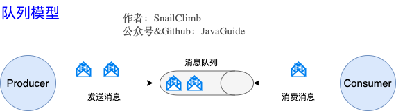
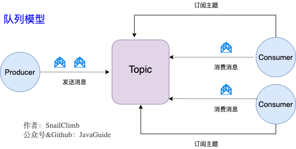
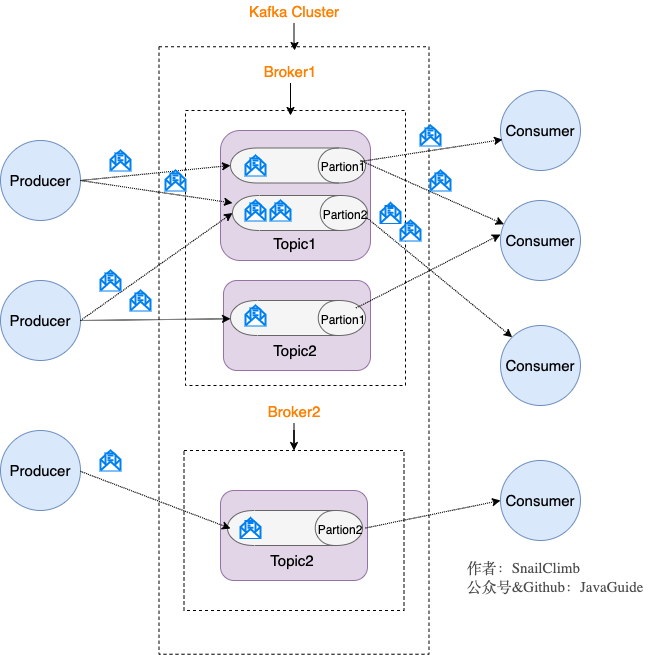
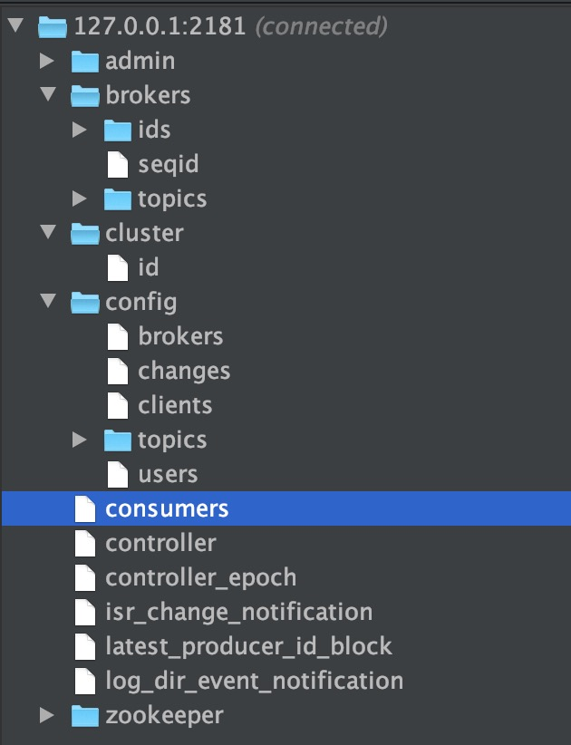
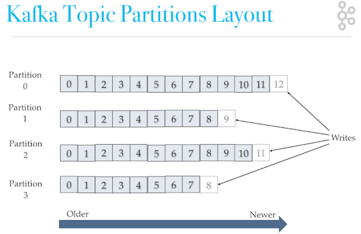

# Kafka

## Kafka是什么？主要应用场景有哪些？

Kafka是一个分布式流式处理平台。流平台具有三个关键功能：

1. **消息队列**：发布和订阅消息流，这个功能类似于消息队列，这也是Kafka也被归类为消息队列的原因。
2. **容错的持久方式存储记录消息流**：Kafka会把消息持久化到磁盘，有效避免了消息丢失的风险。
3. **流式处理平台**：在消息发布的时候进行处理，Kafka提供了一个完整的流式处理类库。

Kafka主要有两大应用场景：

1. **消息队列**：建立实时流数据管道，以可靠地在系统或应用程序之间获取数据。
2. **数据处理**：构建实时的流数据处理程序来转换或处理数据流。

## 和其他消息队列相比，Kafka的优势在哪里？

1. **极致的性能**：基于`Scala`和`Java`语言开发，设计中大量使用了批量处理和异步的思想，最高可以每秒处理千万级别的消息。
2. **生态系统兼容性无可匹敌**：Kafka与周边生态系统的兼容性是最好的没有之一，尤其在大数据和流计算领域。

## 队列模型了解吗？Kafka的消息模式知道吗？

### 队列模型：早起的消息模型

**使用队列(Queue)作为消息通信载体，满足生产者与消费者模式，一条消息只能被一个消费者使用，未被消费的消息在队列中保留直到被消费或超时。**

#### 存在的问题

- 无法处理一条消息被多个消费者消费的场景。

### 发布-订阅模型：Kafka消息模型

发布订阅模型(Pub-Sub)使用**主题(Topic)**作为消息通信载体，类似于**广播模式**；发布者发布一条消息，该消息通过主题传递给所有的订阅者，**在一条消息广播之后才订阅的用户则是收不到该条消息的**。

**在发布-订阅模型中，如果只有一个订阅者，那它和队列模型就基本是一样的了。所以说，发布-订阅模型在功能层面上是可以兼容队列模型的。**

> RocketMQ的消息模型和Kafka基本是完全一样的。唯一的区别是Kafka中没有队列这个概念，与之对应的是`Partition(分区)`。

## 什么是Producer、Consumer、Broker、Topic、Partition？

Kafka将生产者发布的消息发送到**Topic(主题)**中，需要这些消息的消费者可以订阅这些**Topic(主题)**：

1. **Producer(生产者)**：产生消息的一方。
2. **Consumer(消费者)**：消费消息的一方。
3. **Broker(代理)**：可以看做是一个独立的Kafka实例。多个`Kafka Broker`组成一个`Kafka Cluster`。

每个Broker中又包含了Topic和Partition：

1. **Topic(主题)**：Producer将消息发送到特定的主题，Consumer通过订阅特定的Topic来消费消息。
2. **Partition(分区)**：Partition属于Topic的一部分，一个Topic可以有多个Partition，并且同一Topic下的Partition可以分布在不同的Broker上，这也就表明一个Topic可以横跨多个Broker。Partiton可以对应于消息队列中的队列。

## Kafka的多副本机制了解吗？带来了什么好处？

Kafka为分区(Partition)引入了多副本(Replica)机制。分区(Partition)中的多个副本之间会有一个`leader`，其余称为`follower`。我们发送的消息会被发送到`leader`副本，然后`follower`副本才能从`leader`副本中拉取消息进行同步。

> 生产者和消费者只与`leader`副本交互。可以理解为其他副本只是`leader`副本的拷贝，他们的存在只是为了保证消息存储的安全性。当`leader`副本发生故障时会从`follower`中选举出一个`leader`，但是`follower`中如果有和`leader`同步程度达不到要求的参加不了`leader`的竞选。

### 多分区和多副本的好处

1. Kafka通过给特定Topic指定多个Partition，而各个Partition可以分布在不同的Broker上，这样便能提供比较好的并发能力（负载均衡）。
2. Partition可以指定对应的Replica数，这也极大地提高了消息存储的安全性，提高了容灾能力，不过也相应的增加了所需要的存储空间。

## Zookeeper在Kafka中的作用知道吗？

Zookeeper主要为Kafka提供元数据的管理的功能。

1. **Broker注册**：在Zookeeper上会有一个专门用来进行Broker服务器列表记录的节点。每个Broker在启动时，都会到Zookeeper上进行注册，即到`/brokers/ids`下创建属于自己的节点。每个Broker就会将自己的IP地址和端口等信息记录到该节点中去
2. **Topic注册**：在Kafka中，同一个Topic的消息会被分成多个分区并将其分布在多个Broker上，这些分区信息及与Broker的对应关系也都是由Zookeeper在维护。
3. **负载均衡**：对于同一个Topic的不同Partition，Kafka会尽力将这些Partition分布到不同的Broker服务器上。当生产者产生消息后也会尽量投递到不同Broker的Partition里面。当Consumer消费的时候，Zookeeper可以根据当前的Partition数量以及Consumer数量来实现动态负载均衡。

## Kafka如何保证消息的消费顺序？

每次添加消息到Partition的时候都会采用尾加法。Kafka只能为我们保证Partition中的消息有序，而不能保证Topic中的Partition的有序。

> 消息在被追加到Partition的时候都会分配一个特定的偏移量(offset)。Kafka通过offset来保证消息在分区内的顺序性。

Kafka中发送1条消息的时候，可以指定topic，partition，key，data4个参数。如果你发送消息的时候制定了Partition的话，所有消息都会被发送到指定的Partition。并且，同一个key的消息可以保证只发送到同一个Partition，这个我们可以采用表/对象的id来作为key。

## Kafka如何保证消息不丢失

### 生产者丢失消息的情况

设置消息发送失败重试机制。

### 消费者丢失消息的情况

每次在真正消费完消息之后手动提交offset。

### Kafka弄丢了消息

#### leader所在的broker挂掉但是follower还没从leader那完全同步消息

1. 设置`acks = all`
    - `acks`的默认值为1，代表我们的消息被leader副本接收之后就算被成功发送。当我们配置`acks = all`代表所有副本都要接收到该消息之后该消息才算真正成功被发送。
2. 设置`replication.factor >= 3`
    - 为了保证leader副本能有follower副本能同步消息，我们一般会为topic设置replication.factor >= 3。这样就可以保证每个Partition至少有3个副本。虽然造成了数据冗余，但是带来了数据的安全性。
3. 设置`min/insync.replicas > 1`
    - 一般情况下我们还需要设置`min.insync.replicas > 1`，这样配置代表消息至少要被写入到2个副本才算是被成功发送。`min.insync.replicas`的默认值为1，在实际生产中应尽量避免默认值1。
    - 但是，为了保证整个Kafka服务的高可用性，你需要确认`replication.factor > min.insync.replicas`。为什么呢？设想一下加入两者相等的话，只要是有一个副本挂掉，整个分区就无法正常工作了。这明显违反高可用性！一般推荐设置成`replication.factor = min.insync.replicas + 1`。
4. 设置`unclean.leader.election.enable = false`
    - 配置后，当leader副本发生故障时就不会从follower副本中和leader同步程度达不到要求的副本中选择出leader，这样降低了消息丢失的可能性。
> Kafka 0.11.0版本开始`unclean.leader.elecction.enable`参数的默认值由原来的true改为false。

