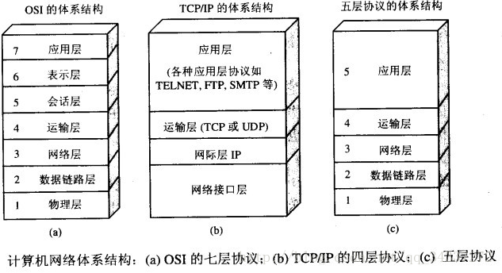
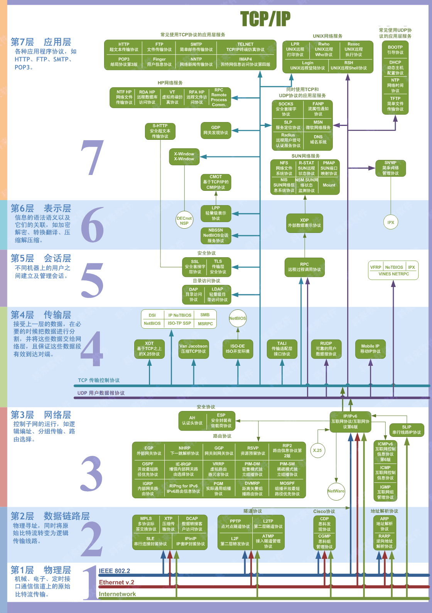
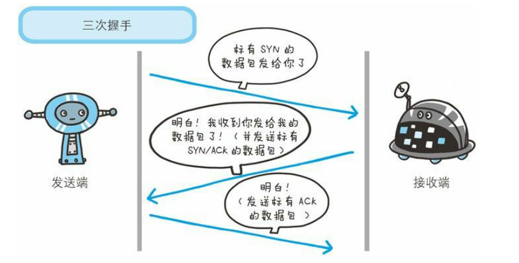
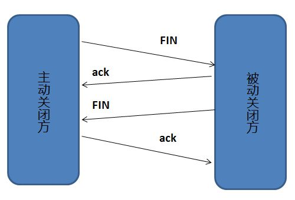
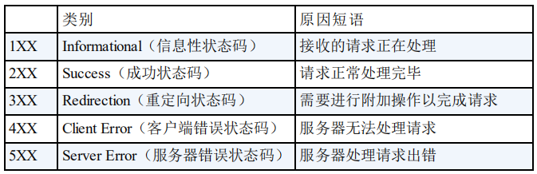

# 计算机网络知识梳理

## OSI与TCP/IP各层的结构与功能，都有哪些协议？

### 应用层

- 应用层的任务是通过应用进程间的交互来完成特定网络应用。应用层协议定义的是应用进程间的通信和交互的规则。例如域名系统DNS，HTTP协议，邮件SMTP协议。

>域名系统(Domain Name System)是可以将域名和IP地址相互映射的一个分布式数据库。

### 运输层

- 运输层的主要任务就是负责向两台主机进程之间的通信提供通用的数据传输服务。运输层主要使用以下两种协议：
    - 传输控制协议TCP(Transmission Control Protocol)：提供**面向连接**的，**可靠**的数据传输服务。
    - 用户数据协议UDP(User Datagram Protocol)：提供**无连接**的，**不可靠**的数据传输服务。

### 网络层

- 在计算机网络中进行通信的两个计算机之间可能会经过很多歌数据链路，也可能还要经过很多通信子网。网络层的任务就是选择合适的网间路由和交换结点，确保数据及时传送。
- 在TCP/IP体系结构中，网络层使用IP协议。

### 数据链路层

- 简称为链路层，将网络层交下来的IP数据报组装成帧，并在两个相邻节点间的链路上传送。

### 物理层

- 物理层的作用是实现相邻计算机节点之间比特流的透明传送，尽可能屏蔽掉具体传输介质和物理设备的差异。

## TCP三次握手和四次挥手

为了准确无误地把数据送达目标处，TCP协议采用了三次握手策略。

### TCP三次握手

#### 为什么要三次握手

- 三次握手的目的是双方确认自己与对方的发送与接收是正常的。

#### 第二次握手传回了ACK，为什么还要传SYN？

- 接收端传回发送端所发送的ACK是为了告诉客户端，我接受到的信息缺失就是你所发送的信号了，这表明从客户端到服务端的通信是正常的。而回传SYN则是为了建立并确认从服务端到客户端的通信。

>SYN同步序列编号(Synchronize Sequence Numbers)是TCP/IP建立连接时使用的握手信号。

### 四次握手

#### 为什么要四次握手

断开一个TCP连接需要四次握手：
- 客户端发送一个FIN，用来关闭客户端到服务端的数据传送
- 服务器收到这个FIN，他发回一个ACK，确认序号为收到的序号加1。和SYN一样，一个FIN将占用一个序号
- 服务器关闭与客户端的连接，发送一个FIN给客户端
- 客户端发回ACK报文确认，并将确认序号设置为收到序号加1

任何一方都可以在数据传送结束后发出连接释放的通知，待对方确认后进入半关闭状态。当另一方也没有数据再发送的时候，则发出连接释放通知，对方确认后就完全关闭了TCP连接。

### TCP，UDP协议的区别

### TCP协议如何保证可靠传输

- 应用数据被分割成TCP认为最适合发送的数据块。
- TCP给发送的每一个包进行编号，接收方对数据包进行排序，把有序数据传送给应用层。
- **校验和**：TCP将保持它首部和数据的检验和。这是一个端到端的检验和，目的是检验数据在传输过程中的任何变化。如果收到段的检验和有差错，TCP将丢弃这个报文段和不确认收到此报文段。
- **流量控制**：TCP连接的每一方都有固定大小的缓冲空间，TCP的接收端只允许发送端发送接收端缓冲区能接纳的数据。当接收方来不及处理发送方的数据，能提示发送方降低发送的速率，防止包丢失。TCP使用的流量控制协议是可变大小的滑动窗口协议。
- **拥塞控制**：当网络拥塞时，减少数据的发送。
- **ARQ协议**：也是为了实现可靠传输的，它的基本原理就是每发完一个分组就停止发送，等待对方确认。在收到确认后再发下一个分组。
- **超时重传**：当TCP发出一个段后，它启动一个定时器，等待目的端确认收到这个报文段。如果不能及时收到一个确认，将重发这个报文段。

### 在浏览器中输入url地址 ->> 显示主页的过程

> 上图有一个错误，请注意，是OSPF不是OPSF。 OSPF（Open Shortest Path First，ospf）开放最短路径优先协议,是由Internet工程任务组开发的路由选择协议

总的来说分为以下几个过程：
- DNS解析
- TCP连接
- 发送HTTP请求
- 服务器处理请求并返回HTTP报文
- 浏览器解析渲染页面
- 连接结束

### 状态码

### 各种协议与HTTP协议之间的关系

### HTTP长连接

- 响应头中加入参数`Connection:keep-alive`

### URI和URL的区别

- `URI(Uniform Resource Identifier)`是统一资源标识符，可以唯一标识一个资源
- `URL(Uniform Resource Location)`是统一资源定位符，可以提供该资源的具体路径，是一种具体的`URI`
