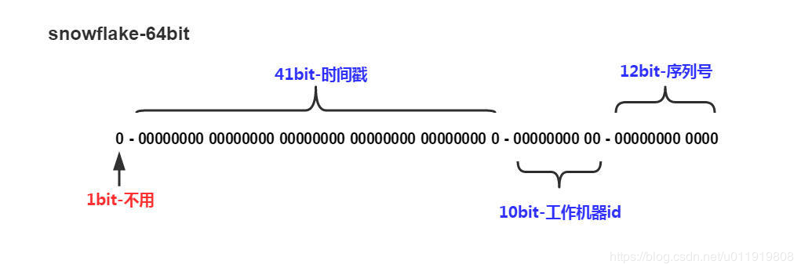

# 分布式id

## 分布式id生成方案

### 雪花算法(snowflake)

#### 核心思想

分布式ID固定是一个long型的数字，一个long型占8个字节，也就是64个bit，原始snowflake算法中对于bit的分配如下图：



- 第一个bit位是标识部分，在java中由于long的最高位是符号位，正数是0，负数是1，一般生成的ID为正数，所以固定为0。
- 时间戳部分占41bit，这个是毫秒级的时间，一般实现上不会存储当前的时间戳，而是时间戳的差值（当前时间-固定的开始时间），这样可以使陈胜的ID从更小值开始；41位的时间戳可以使用69年，(1L << 41) / (1000L * 60 * 60 * 24 * 365) = 69年
- 工作机器id占10bit，这里比较灵活，比如，可以使用前5位作为数据中心机房标识，后5位作为单机房机器标识，可以部署1024个节点。
- 序列号部分占12bit，支持同一毫秒内同一个节点可以生成4096个ID

#### 缺点

- sonwflake算法中最难实践的就是工作机器id，原始的snowflake算法需要人工去为每台机器去指定一个机器id，并配置在某个地方从而让sonwflake从此处获取机器id。机器很多的情况下，人力成本太大且容易出错。

### Redis

可以利用Redis中的`incr`命令来实现原子性的自增与返回，比如：

```shell
    127.0.0.1:6379> set seq_id 1           //初始化自增ID为1
    OK
    127.0.0.1:6379> incr seq_id            //增加1，并返回
    (integer) 2
    127.0.0.1:6379> incr seq_id            //增加1，并返回
    (integer) 3
```

使用Redis的效率是非常高的，但是要考虑持久化的问题。Redis支持`RDB`和`AOF`两种持久化的方式。

- `RDB`持久化：相当于定时打一个快照进行持久化，如果打完快照后，连续自增了几次，还没来得及做下一次快照持久化，这个时候Redis挂掉了，重启Redis后会出现ID重复。
- `AOF`持久化：相当于对每条写命令进行持久化，如果Redis挂掉了，不会出现ID重复的现象，但是会由于`incr`命令过多，导致重启恢复数据时间过长。